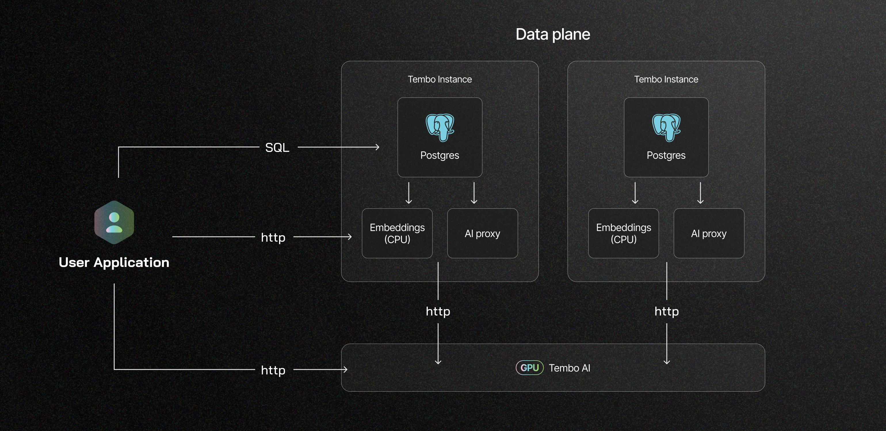

The Tembo AI platform is designed specifically to provide engineering teams with the most convenient and secure way to build with artificial intelligence and PostgreSQL. Tembo AI is a comprehensive solution that integrates both chat and embedding models into your PostgreSQL environment, enabling a seamless and powerful experience for building GenAI applications.


### **GPU Compute in Tembo Cloud and Self Hosted**

Tembo already supports hosting hundreds of [embedding models](https://tembo.io/docs/product/cloud/apps/embeddings), including those privately trained on CPU isolated to your Tembo Cloud environment. Tembo AI brings GPU support into the platform, providing significantly improved latency and throughput. With Tembo AI, users have all the same flexibility as our embedding service and now have the ability to call chat models on their Tembo infrastructure.


### **Beyond third-party hosting providers**

Hooking into third party hosting providers is not enough for many users. For users who do not want to share their data with LLM providers, there is only one-option: self-hosted. [Tembo Self Hosted](https://tembo.io/docs/product/software/tembo-self-hosted/overview) users get embedding and chat models built into their solution, allowing them to generate embeddings and call chat models without data leaving their infrastructure. Tembo Cloud and Tembo Self Hosted users have embedding and chat models available to them at and hook into their database with minimal configuration.


#### **Seamless Integration with Tembo Cloud and Self-Hosted Options**

In our Alpha release, Tembo AI supports [Meta-Llama-3-8B-Instruct](https://huggingface.co/meta-llama/Meta-Llama-3-8B-Instruct), and is available for both Tembo Cloud and Tembo Self Hosted users. This means Tembo users now have both embedding models and chat models available to them, all within the Tembo infrastructure. Between now and the GA release of Tembo AI, we will support best-in-class models at each tier of model sizes; 8B, 30B, and 70B+, starting with Tembo Cloud - Tembo AI runs as a shared service available to all cloud users. Each Tembo user is billed for their usage, at a flat rate of  $0.15 per 1M tokens, regardless of input or output token. Tembo Self Hosted users get dedicated LLM hosting.





### **Optimized for PostgreSQL**

Tembo AI is built on a robust PostgreSQL foundation, incorporating a suite of best-in-class extensions tailored for AI development. These extensions include:


* **[vector](https://pgt.dev/extensions/pgvector) + [vectorscale](https://pgt.dev/extensions/vectorscale)**: Facilitate the storage, retrieval, and searching of embeddings directly within your database.
* **[pg_vectorize](https://pgt.dev/extensions/vectorize)**: A versatile tool that not only generates embeddings but also keeps them updated. It allows for the direct calling of chat models from SQL, simplifying the process of building Retrieve and Generate (RAG) applications.


## **SQL and HTTP integrations**

Tembo AI can be reached from both SQL and HTTP.

In SQL, Tembo AI models can be reached by prefixing the model name with `/tembo`. These route the requests to Tembo infrastructure and bills your Tembo Cloud account.


```sql
select vectorize.generate(
  input => 'Tell me the difference between a cat and a dog in 1 sentence',
  model => 'tembo/meta-llama/Meta-Llama-3-8B-Instruct'
);
```


```plaintext

                                                 generate                                                  
-----------------------------------------------------------------------------------------------------------
 Cats are generally more independent and solitary, while dogs tend to be more social and loyal companions.
(1 row)
```


For a drop-in replacement for OpenAI, you can call Tembo LLMs directly using HTTP or one of the OpenAI client libraries. The API is fully compatible with OpenAI’s API schema.


```bash
curl -X POST https://$YOUR_TEMBO_HOST.data-1.use1.tembo.io/ai/v1/chat/completions \
-H "Content-Type: application/json" \
-H "Authorization: Bearer $YOUR_TEMBO_AUTH_TOKEN" \
-d '{
  "model": "meta-llama/Meta-Llama-3-8B-Instruct",
  "messages": [{"role": "user", "content": "Tell me the difference between a cat and a dog in 1 sentence"}]
}'
```


```json
{
  "choices": [
    {
      "finish_reason": "stop",
      "index": 0,
      "logprobs": null,
      "message": {
        "content": "The main difference between a cat and a dog is that cats are generally more independent and aloof, preferring to spend time alone, whereas dogs are often more social and pack-oriented, thriving on interaction and attention from their human family members.",
        "role": "assistant"
      },
      "stop_reason": null
    }
  ],
  "created": 1720798146,
  "id": "cmpl-6e54ff8832ee48a294f10dbcb6a4b1ae",
  "model": "meta-llama/Meta-Llama-3-8B-Instruct",
  "object": "chat.completion",
  "usage": {
    "completion_tokens": 48,
    "prompt_tokens": 25,
    "total_tokens": 73
  }
}
```


### **Compatible with OpenAI SDKs**

Tembo AI hosted LLMs are compatible with the OpenAI SDKs.
 Simply set the base URL to your Tembo instance and use your Tembo API key to authenticate.

```python
import os
from openai import OpenAI

client = OpenAI(
    base_url="https://$YOUR_TEMBO_HOST.data-1.use1.tembo.io/ai/v1",
    api_key=os.environ["YOUR_TEMBO_AUTH_TOKEN"],
)

chat_completion = client.chat.completions.create(
    messages=[
        {
            "role": "user",
            "content": "Use the word 'apple' in a single sentence.",
        }
    ],
    model="meta-llama/Meta-Llama-3-8B-Instruct",
)

print(chat_completion.choices[0].message.content)
```

```plaintext
She bit into the crisp, juicy apple and savored the sweet taste.
```


### **Why Choose Tembo AI?**

Tembo AI is a convenient and cost-effective way to build AI applications. It eliminates the complexity of adopting and managing databases and model hosting and allows developers to focus on what they do best — creating effective applications.

Tembo AI is currently available in Alpha for all Tembo Cloud users with a payment method on file and is an opt-in feature for all Tembo Self Hosted users. 

As always, we love to hear from you about what functionality you’d like us to work on next. Please suggest and upvote features via roadmap.tembo.io/roadmap.


