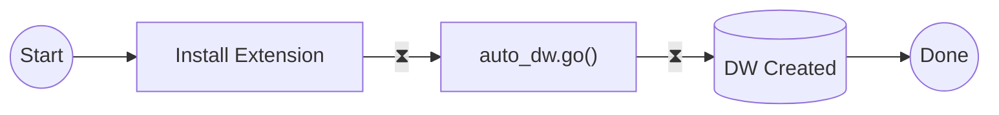

import Callout from '../../../components/Callout.astro';

[pg_auto_dw](https://github.com/tembo-io/pg_auto_dw) is an auto-data warehouse extension to use GenAI to inspect transactional Postgres schemas, and automate the creation of well-formed data warehouse, using [Data vault modeling](https://en.wikipedia.org/wiki/Data_vault_modeling).

Our objective is to help software engineers access high-quality data warehousing when they don't have access to an expert data architect. I have wanted this badly for years as a dev + data engineer, and my messy data warehouses that usually feature a pile of ingested tables, and ad-hoc derivative tables :)

We're partnering with our friend Johnathan Pickard from [Analyzer1](https://www.analyzer1.com/) to iterate with us on this project, as he will transition his previously built automations to be as fully-automated as GenAI makes possible.

## But why Postgres for data warehousing?

* **Postgres for everything** — Postgres has historically been the de-facto operational store—and now people are beginning to use it for analytics and data warehousing.
* **Efficient data warehouse schemas** - One of the key things for DWH performance is the data structure and transformations going from operations to analytics. There are best practices such as Kimball or Data Vault that many software engineers aren't highly familiar with.
* **Doing transformations in Postgres** - If Postgres is your operational store and your analytics store, why not rely on Postgres to do the transformations. With LLMs, we had the hunch that we could do this automatically.

## And why Postgres for data warehouse automation?  

We do not believe that automating the creation of data warehousing structures should be offloaded and partitioned at the analytic edge.  Classically, operational data is offloaded at interval to be processed by a dedicated data team. 

This approach has disadvantages. Firstly, it makes operational analytics an afterthought or at least an expensive and time consuming endeavor.  Secondly, it creates a very broad data sprawl which directly conflicts with the paradigm of a unified data model.  

Postgres stands as the world's most popular, comprehensive, and extensible open-source database, with its growing trend reinforcing its future-proof status.

## How the extension works

If your source tables are well-structured and tables and fields are well-named, constructing a data warehouse can be achieved with a single call to the extension.

```SQL
SELECT auto_dw.go();
```



### Informative Functions

These functions do not affect the database:

* `health()` — Understand DW health
* `source_tables()` - Understand the status of all tables
* `source_columns()` — Understand the status of all table columns

### Interactive Functions

These functions affect the data warehouse portion of the database:

* `source_include(object_pattern)` — Add source objects
* `source_exclude(object_pattern)` — Remove source objects
* `update_context(object, context)` — Provide additional context to fine tune the automation
* `go(flag, status)` — Initiates the build and dataflows

[Read more in the docs](https://github.com/tembo-io/pg_auto_dw/blob/main/extension/docs/sql_functions/readme.md).

## Join us on the Journey

We are just getting started. Our development process is transparent and [open for collaboration on GitHub](https://github.com/tembo-io/pg_auto_dw). 

We invite developers, data scientists, and technology enthusiasts to join us. Your insights and contributions are invaluable as we push the boundaries of what is possible.

Stay tuned for upcoming demos and update blog posts related to building and using this extension.