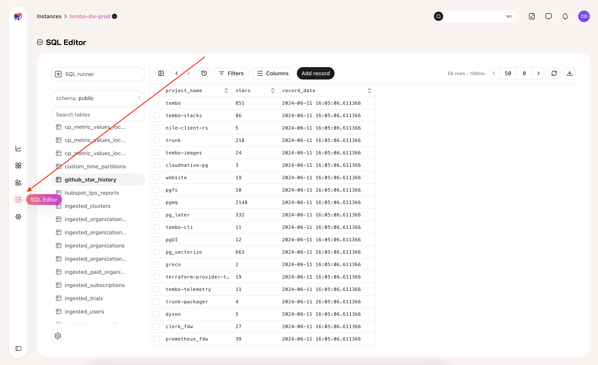
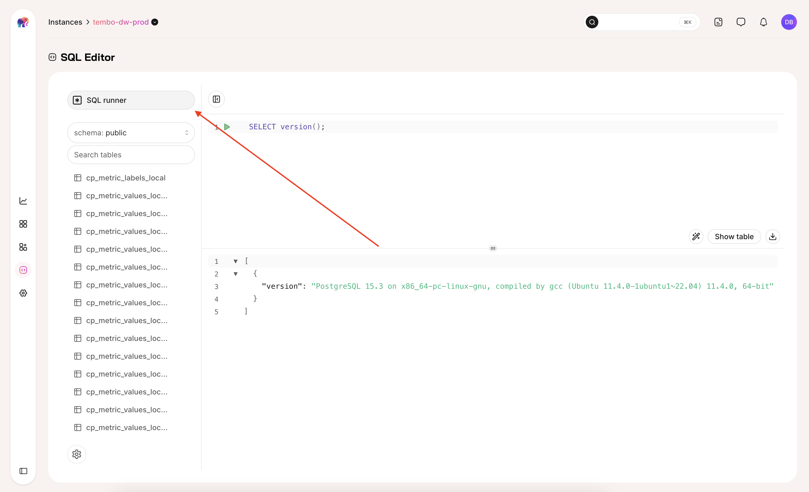
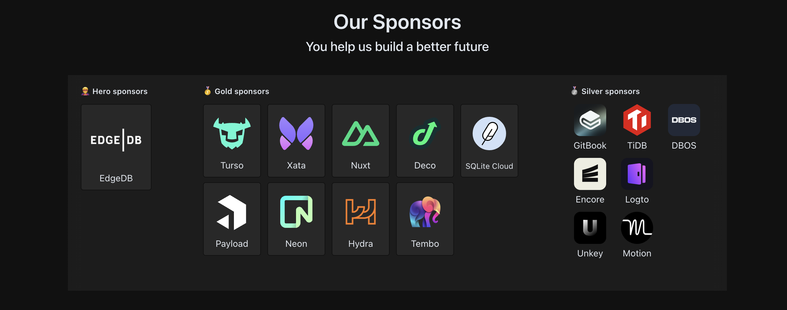

We're excited to announce a new "SQL Editor" tab in the Tembo Cloud Dashboard UI, which lets you explore tables and edit + run queries directly from your browser!

There are some great features including:

1. Table editor (edit, add, remove, filter)
2. SQL runner (run any query you want from the browser)
3. Switch between different schemas
4. Advanced filtering, JSON support and formatting

**You can find the SQL Editor tab in the SideBar after clicking on an instance:**

Clicking on the "SQL Runner" button will allow you to write any arbitrary query and execute it against your database. Queries written in this view are automaticially persisted so you can leave and come back to the page without losing your work.

## Powered by Drizzle Studio

Our SQL Editor is powered by [Drizzle Studio](https://www.npmjs.com/package/@drizzle-team/studio) and Tembo is proud to be sponsoring their amazing [open-source Typescript orm project](https://orm.drizzle.team/):

