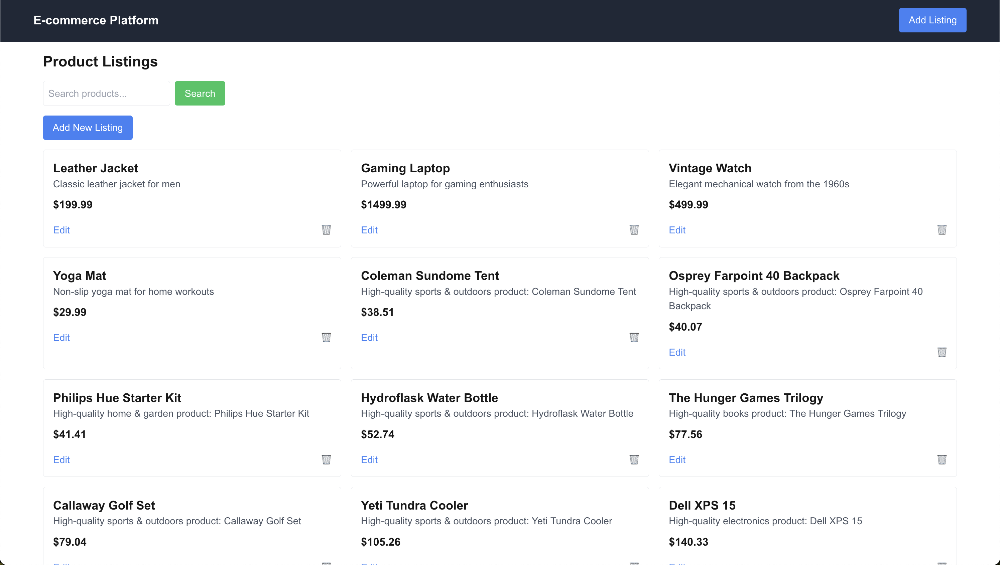
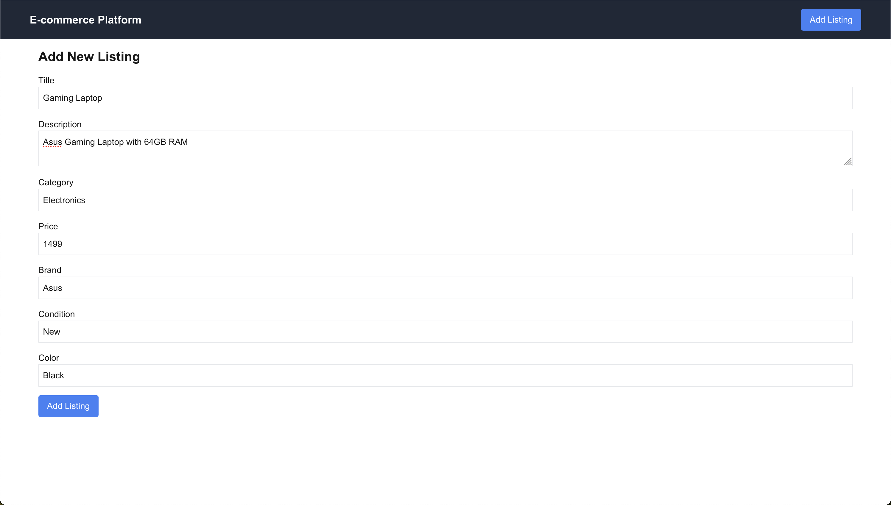
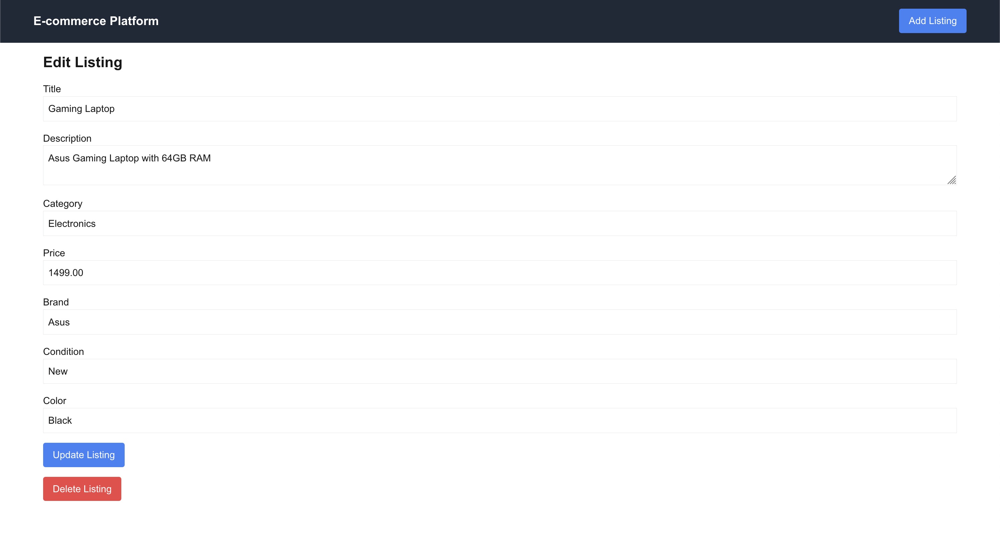
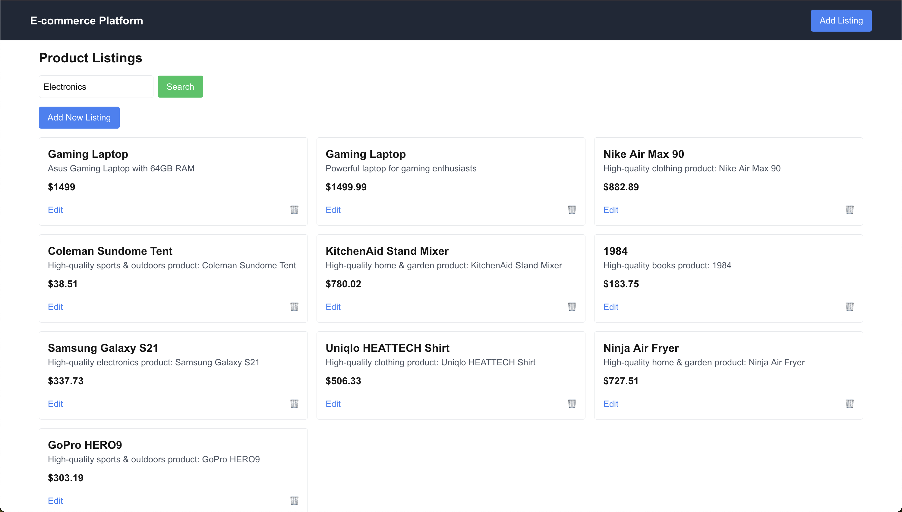

In this tutorial, we'll build a modern e-commerce platform that leverages vector search capabilities using [Tembo's VectorDB Stack](https://tembo.io/docs/product/stacks/ai/vectordb/getting-started#). We'll create a full-featured product listing application with semantic search capabilities, allowing users to find products using natural language queries.

💡 **_Pro tip_:** _The fastest way to follow along is to clone the [repository](https://github.com/tembo-io/tembo-labs/tree/main) and `cd` into the `vector-search-app` directory. However, we'll walk through each vector search related step in detail if you prefer to build from scratch!_

## Prerequisites

-   [Node.js](https://nodejs.org/en/download/package-manager) installed on your system
-   A [Tembo Cloud](<[https://cloud.tembo.io](https://cloud.tembo.io/)>) account
-   Basic knowledge of [React](https://react.dev/) and [TypeScript](https://www.typescriptlang.org/)
-   Familiarity with [Next.js](https://nextjs.org/docs)

## Setting Up Tembo VectorDB Stack

1. Create a Tembo Cloud Account:
    - Visit [cloud.tembo.io](https://cloud.tembo.io/)
    - Sign up for a new account
2. Create a New Instance:
    - From your Tembo dashboard, click "Create Instance"
    - Select "VectorDB Stack" as your instance type
    - Choose your preferred region and instance size
    - Give your instance a name
    - Select "Create Instance"
3. Connect to your instance via the terminal:

    ```bash
    psql 'postgresql://postgres:<your-password>@<your-host>:5432/postgres'
    ```

4. Configure the OpenAI integration to be able to generate embeddings:

    ```sql
    ALTER SYSTEM SET vectorize.openai_key TO '<your OpenAI API key>';
    SELECT pg_reload_conf();
    ```

5. Create the Products table:

    ```sql
    CREATE TABLE products (
        id SERIAL PRIMARY KEY,
        title TEXT NOT NULL,
        description TEXT NOT NULL,
        category TEXT NOT NULL,
        price TEXT NOT NULL,
        brand TEXT NOT NULL,
        condition TEXT NOT NULL,
        color TEXT NOT NULL
    );

    ```

6. Add a last_updated_at column to the Products table:

    ```sql
    ALTER TABLE products
    ADD COLUMN last_updated_at TIMESTAMP DEFAULT CURRENT_TIMESTAMP;
    ```

7. Initialize vector search:

    ```sql
    SELECT vectorize.table(
        job_name => 'product_search_openai',
        "table" => 'products',
        primary_key => 'id',
        columns => ARRAY['title', 'description', 'category'],
        transformer => 'openai/text-embedding-ada-002',
        schedule => 'realtime'
    );

    ```

8. Test your vector search setup:

    ```sql
    -- Insert a test product
    INSERT INTO products (title, description, category, price, brand, condition, color)
    VALUES ('Test Product', 'This is a test description', 'Electronics', '99.99', 'TestBrand', 'New', 'Black');

    -- Test search functionality
    SELECT * FROM vectorize.search(
        job_name => 'product_search_openai',
        query => 'electronic devices',
        return_columns => ARRAY['id', 'title', 'description'],
        num_results => 10
    );
    ```

9. Save your connection details:

-   From the Tembo dashboard, copy your connection string
-   Create a `.env.local` file in your project root
-   Add the following environment variables:

```
POSTGRES_VECTORDB_URL=your_connection_string
POSTGRES_CA_CERT=your_ca_certificate
```

## Project Structure

Our project follows a standard Next.js structure with the App Router. The main components are:

1. Server Actions for database operations

2. Product listing page

3. Add/Edit product forms
4. Client-side components for search functionality

## Implementing Database Operations

Let's start by creating our database operations. Create a new file for our [server actions](https://github.com/tembo-io/tembo-labs/blob/main/vector-search-app/app/actions/vectordb.ts):

```jsx
"use server";

import { redirect } from "next/navigation";
import { Pool } from "pg";

export type Product = {
  id?: number;
  title: string;
  description: string;
  category: string;
  price: string;
  brand: string;
  condition: string;
  color: string;
};

const pool = new Pool({
  connectionString: process.env.POSTGRES_VECTORDB_URL!,
  ssl: {
    ca: process.env.POSTGRES_CA_CERT!,
  },
});

export async function list() {
  const client = await pool.connect();
  try {
    const query = `SELECT * FROM products`;
    const result = await client.query(query);
    return result.rows;
  } finally {
    client.release();
  }
}

export async function load(product: Product) {
  const { title, description, category, price, brand, condition, color } =
    product;

  const client = await pool.connect();
  try {
    const query = `INSERT INTO products (title, description, category, price, brand, condition, color) VALUES ($1, $2, $3, $4, $5, $6, $7)`;
    const values = [
      title,
      description,
      category,
      price,
      brand,
      condition,
      color,
    ];
    const result = await client.query(query, values);

    redirect("/");
    return result;
  } finally {
    client.release();
  }
}

export async function get(id: number) {
  const client = await pool.connect();
  const query = `SELECT * FROM products WHERE id = $1`;
  const result = await client.query(query, [id]);
  return result.rows[0];
}

export async function update(product: Product) {
  const { id, title, description, category, price, brand, condition, color } =
    product;
  const client = await pool.connect();

  try {
    const query = `UPDATE products SET title = $1, description = $2, category = $3, price = $4, brand = $5, condition = $6, color = $7 WHERE id = $8`;
    const values = [
      title,
      description,
      category,
      price,
      brand,
      condition,
      color,
      id,
    ];

    await client.query(query, values);
    redirect("/");
  } finally {
    client.release();
  }
}

export async function deleteProduct(id: number) {
  const client = await pool.connect();
  try {
    const query = `DELETE FROM products WHERE id = $1`;
    await client.query(query, [id]);
    redirect("/");
  } finally {
    client.release();
  }
}

export async function searchProducts(query: string) {
  const client = await pool.connect();
  try {
    const searchQuery = `
      SELECT * FROM vectorize.search(
        job_name => 'product_search_openai',
        query => $1,
        return_columns => ARRAY['id', 'title', 'description', 'category', 'price', 'brand', 'condition', 'color'],
        num_results => 10
      );
    `;
    const result = await client.query(searchQuery, [query]);
    const parsedResult = result.rows.map((row) => {
      const parsedRow = row.search_results;
      return {
        id: parsedRow.id as number,
        title: parsedRow.title as string,
        description: parsedRow.description as string,
        category: parsedRow.category as string,
        price: parsedRow.price as string,
        brand: parsedRow.brand as string,
        condition: parsedRow.condition as string,
        color: parsedRow.color as string,
        similarity_score: parsedRow.similarity_score as number,
      };
    });
    return parsedResult;
  } finally {
    client.release();
  }
}
```

This file contains all our database operations including:

-   Listing products
-   Getting a product
-   Adding new products
-   Updating products
-   Deleting products
-   Vector search functionality

## Creating the Product List Component

Our main [product list component](https://github.com/tembo-io/tembo-labs/blob/main/vector-search-app/app/_components/ClientProductList.tsx) handles both display and search functionality:

This component includes:

-   Real-time search functionality
-   Product grid display
-   Edit and delete operations
-   Responsive design using Tailwind CSS



## Adding New Products

The [Add Listing page](https://github.com/tembo-io/tembo-labs/blob/main/vector-search-app/app/add-listing/page.tsx) allows users to create new product listings:



## Editing Products

The [Edit Listing page](https://github.com/tembo-io/tembo-labs/blob/main/vector-search-app/app/edit-listing/[id]/page.tsx) allows users to modify existing products:



## Vector Search Implementation

The most interesting part of our application is the vector search functionality. When users enter a search query, we:

-   Send the query to our server action
-   Use Tembo's vector search capabilities to find relevant products
-   Return semantically similar results

The search implementation can be found in our [`vectordb.ts`](https://github.com/tembo-io/tembo-labs/blob/main/vector-search-app/app/actions/vectordb.ts) and [`ClientProductList.tsx`](https://github.com/tembo-io/tembo-labs/blob/main/vector-search-app/app/_components/ClientProductList.tsx) files:

```jsx
// vectordb.ts
export async function searchProducts(query: string) {
  const client = await pool.connect();
  try {
    const searchQuery = `
      SELECT * FROM vectorize.search(
        job_name => 'product_search_openai',
        query => $1,
        return_columns => ARRAY['id', 'title', 'description', 'category', 'price', 'brand', 'condition', 'color'],
        num_results => 10
      );
    `;
    const result = await client.query(searchQuery, [query]);
    const parsedResult = result.rows.map((row) => {
      const parsedRow = row.search_results;
      return {
        id: parsedRow.id as number,
        title: parsedRow.title as string,
        description: parsedRow.description as string,
        category: parsedRow.category as string,
        price: parsedRow.price as string,
        brand: parsedRow.brand as string,
        condition: parsedRow.condition as string,
        color: parsedRow.color as string,
        similarity_score: parsedRow.similarity_score as number,
      };
    });
    return parsedResult;
  } finally {
    client.release();
  }
}
```

```tsx
// ClientProductList.tsx
'use client';

import { useState } from 'react';
import { deleteProduct, searchProducts, Product } from '../actions/vectordb';
import Link from 'next/link';

export default function ClientProductList({
	initialProducts,
}: {
	initialProducts: Product[];
}) {
	const [products, setProducts] = useState<Product[]>(initialProducts);
	const [query, setQuery] = useState('');

	const handleSearch = async (e: React.FormEvent<HTMLFormElement>) => {
		e.preventDefault();
		if (query.trim() === '') {
			setProducts(initialProducts);
		} else {
			const result = await searchProducts(query);
			setProducts(result);
		}
	};

	const handleDelete = async (id: number) => {
		await deleteProduct(id);
		const updatedProducts = await searchProducts('');
		setProducts(updatedProducts);
	};

	return (
		<div className='container mx-auto p-4'>
			<h1 className='text-2xl font-bold mb-4'>Product Listings</h1>
			<form onSubmit={handleSearch} className='mb-4'>
				<input
					type='text'
					value={query}
					onChange={(e) => {
						setQuery(e.target.value);
						if (e.target.value.trim() === '') {
							setProducts(initialProducts);
						}
					}}
					placeholder='Search products...'
					className='border p-2 rounded mr-2'
				/>
				<button
					type='submit'
					className='bg-green-500 text-white px-4 py-2 rounded hover:bg-green-600'
				>
					Search
				</button>
			</form>
			<Link
				href='/add-listing'
				className='bg-blue-500 text-white px-4 py-2 rounded hover:bg-blue-600 mb-4 inline-block'
			>
				Add New Listing
			</Link>
			<div className='grid grid-cols-1 md:grid-cols-2 lg:grid-cols-3 gap-4'>
				{products.map((product) => (
					<div
						key={product.id}
						className='border p-4 rounded relative'
					>
						<h2 className='text-xl font-semibold'>
							{product.title}
						</h2>
						<p className='text-gray-600'>{product.description}</p>
						<p className='text-lg font-bold mt-2'>
							${product.price}
						</p>
						<div className='flex justify-between items-center mt-4'>
							<Link
								href={`/edit-listing/${product.id}`}
								className='text-blue-500 hover:underline'
							>
								Edit
							</Link>
							<button
								onClick={() => handleDelete(product.id!)}
								className='text-red-500 hover:text-red-700'
								aria-label='Delete product'
							>
								🗑️
							</button>
						</div>
					</div>
				))}
			</div>
		</div>
	);
}
```



## Testing the Application

1. Start the development server:

```bash
npm run dev
```

1. Navigate to http://localhost:3000
2. Try adding some products
3. Test the vector search functionality with natural language

## Key Features

-   Semantic search using vector embeddings
-   Real-time search results
-   CRUD operations via server actions for products
-   Type safety with TypeScript

This project demonstrates how to build a modern e-commerce platform with vector search capabilities using [Tembo's VectorDB Stack](https://tembo.io/docs/product/stacks/ai/vectordb/getting-started#). This stack provides a powerful foundation for building sophisticated search experiences. We’d love to hear what you think. Give us a shoutout on [X](https://x.com/tembo_io), or connect with us in our [community Slack](https://join.slack.com/t/tembocommunity/shared_invite/zt-277pu7chi-NHtvHWvLhHwyK0Y5Y6vTPw).
