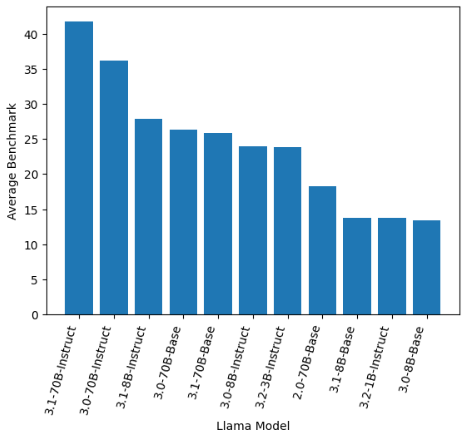

A couple months ago we announced support for LLM and embedding model hosting on Tembo AI.
 We are continuing the development of that platform and today are announcing support for two models; [meta-llama/Llama-3.2-3B](https://huggingface.co/meta-llama/Llama-3.2-3B-Instruct) and [meta-llama/Llama-3.1-8B-Instruct](https://huggingface.co/meta-llama/Llama-3.1-8B-Instruct).
 We have discontinued support for Meta-Llama-3-8B-Instruct and requests for that model will be routed to Llama-3.1-8B-Instruct without interruption.

## Overview of Llama 3.1 and 3.2

Meta released a [collection](https://huggingface.co/collections/meta-llama/llama-32-66f448ffc8c32f949b04c8cf) of models in their 3.2 series.
 The 3.2 series includes text-only models of 1B and 3B parameters which are intended to be deployed in resource constrained environments such as mobile or edge devices.
 The 3.2 series also includes multi-model models, of 11B and 90B variants.
 The 3.2 11B is roughly equivalent to the 3.1 8B model in terms of its text-text capabilities, but also includes image capabilities.

In summary - the Llama 3.2 series introduced new capabilities, but not necessarily improvement to text-text performance. It did introduce vision capabilities on top of the text capabilities of the 3.1 series.
 It also introduced smaller models for resource constrained environments. Llama 3.1-8B-Instruct is available on Tembo Cloud, but we are not hosting the 3.2 series at this time.

## Model Performance

While Tembo Cloud hosts the Llama 3.1 8B-Instruct model for all users, self-hosted users can run any model supported by [vLLM](https://github.com/vllm-project/vllm/blob/main/docs/source/models/supported_models.rst).
 There is a [formula](https://training.continuumlabs.ai/infrastructure/data-and-memory/calculating-gpu-memory-for-serving-llms) for estimating how much GPU memory is required to host a model, and its been heavily written about before.
 Main thing to note, to host a 70B parameter model you will need 168GB of GPU memory, while an 8B parameter model will need 19GB of GPU memory.
 You can lower the memory requirements by using [quantization](https://huggingface.co/docs/transformers/en/main_classes/quantization) but it does come at the cost of performance.

It is a large jump in memory requirements to go from the 8B to the 70B models, but is it worth it?
 We can look at some [benchmarks](https://huggingface.co/spaces/open-llm-leaderboard/open_llm_leaderboard) to get a sense for how these models perform.
 The leaderboard evaluates models across a number tasks involving mathematical reasoning, language understanding, world knowledge, and ability to follow instructions.
 Depending on your use case, you might care more about one of the evaluations than the other.
 The average is a good indicator overall though.

We've extracted all the `meta-llama` from the [Open LLM Leaderboard](https://huggingface.co/spaces/open-llm-leaderboard/open_llm_leaderboard) and visualized below.



The 70B parameter models are the highest performing overall, but they are also significantly more resource intensive compared to the 8B models.
 You'll be able to run an 8B parameter model and an Nvidia A10 or L4, while the 70B models will most likely require an H100 unless you explore quantization.

## Run this on Tembo


You can call the Llama 3.1-8B-Instruct model on Tembo Cloud using the following curl command.

```bash
curl -X POST https://${YOUR_TEMBO_HOST}.data-1.use1.tembo.io/ai/v1/chat/completions \
    -H "Authorization: Bearer ${YOUR_TEMBO_JWT}" \
    -H "Content-Type: application/json" \
    -d '{"messages": [{"role": "user", "content": "Say --hello-world--"}], "model": "meta-llama/Llama-3.1-8B-Instruct"}'
```

For development purposes we recommend using our alias, `tembo-small-instruct` which will always route to the latest small instruct model (which is Llama 3.1-8B-Instruct at this time).

```bash
curl -X POST https://${YOUR_TEMBO_HOST}.data-1.use1.tembo.io/ai/v1/chat/completions \
    -H "Authorization: Bearer ${YOUR_TEMBO_JWT}" \
    -H "Content-Type: application/json" \
    -d '{"messages": [{"role": "user", "content": "Say --hello-world--"}], "model": "tembo-small-instruct"}'
```

Notice the `model` attribute returned in the response. This will always reflect the specific model used within the inference engine.

```plaintext
{
  "choices": [
    {
      "finish_reason": "stop",
      "index": 0,
      "logprobs": null,
      "message": {
        "content": "Hello, World!",
        "role": "assistant",
        "tool_calls": []
      },
      "stop_reason": null
    }
  ],
  "created": 1730469471,
  "id": "chat-6aaab9b5fc684d8c93ee87a1b78a1191",
  "model": "meta-llama/Llama-3.1-8B-Instruct",
  "object": "chat.completion",
  "prompt_logprobs": null,
  "usage": {
    "completion_tokens": 5,
    "prompt_tokens": 38,
    "total_tokens": 43
  }
}
```

You can also run this directly in SQL using the `vectorize.generate` function.

```sql
select vectorize.generate(
    input => $$say 'hello-world'$$,
    model => 'tembo/tembo-small-instruct'
);
```

```plaintext
   generate    
---------------
 Hello, World!
(1 row)
```


## Going forward

The specific models we host will change over time, and we will maintain backwards compatibility. For example, if you request Llama 3-8B-Instruct, you will get Llama 3.1-8B-Instruct.
 We will also continue to add new models as they are released. 
