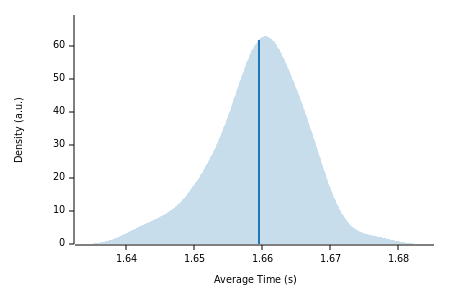
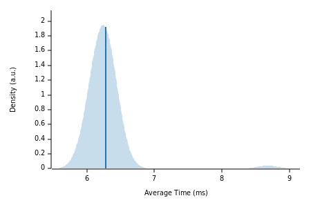
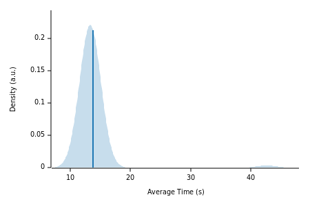
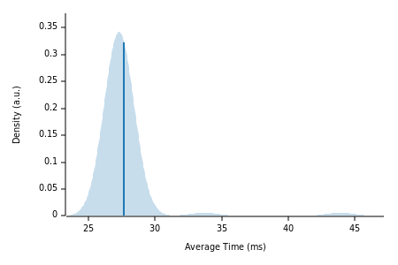

We've previously written about the analytics capabilities of Tembo's ParadeDB integration, but did you know about ParadeDB's lightning-fast search capabilities as well? [ParadeDB](https://tembo.io/docs/product/stacks/analytical/paradedb) provides `pg_search`, a complete full-text search solution for PostgreSQL built atop [BM25](https://en.wikipedia.org/wiki/Okapi_BM25) and [Tantivy](https://github.com/quickwit-oss/tantivy).

## Full-Text Search in PostgreSQL

PostgreSQL is often described as a "batteries included" piece of software: a default install provides many high-quality and well-integrated solutions to the many disparate problems encountered when operating a database. [Full Text Search](https://www.postgresql.org/docs/current/textsearch.html) is no exception, as PostgreSQL's native text search types (`tsvector`, `tsquery`, etc.) and operators (`@@`) slot seamlessly into daily database use.

However, there is still room for improvement. Software such as Apache Lucene and Elasticsearch have raised expectations developers have for the ease of use and performance of text search features, and such developers often resort to operating a separate search stack just to achieve these gains.

## ParadeDB's `pg_search`

But as we've seen time and time again, PostgreSQL is flexible enough to absorb these use cases whole: why shuffle data off to some external indexer instead of searching it in the database already storing it?

A particular weakness of PostgreSQL's search implementation is that the ranking functions are not generally indexable. Because of this, changing a query from "show me five results" to "show me the top five relevant results" can have poor scaling characteristics. This is the use case we'll highlight in this post.

## Benchmarking

For this benchmark, I used ParadeDB's own [`cargo-paradedb`](https://github.com/paradedb/paradedb/tree/dev/cargo-paradedb) tool to generate workloads and queries. It wraps a Go tool which generates the Elastic vs OpenSearch Benchmark corpus and which can create GIN and BM25 indexes for benchmarking.

The default search query simply requests a certain number of matches. While useful, I believe sorting by some sort of rank is more representative of real-world use. To that end, I [modified](https://github.com/jasonmp85/paradedb/commit/f6c7ca1b39b1e92ee4c2717368d5df352100e050) the tool's SQL to include a "top N"-like sort.

### 10MM Rows

To start, I generated a corpus of around 10MM rows (specifically 10,058,178). The GIN index supporting PostgreSQL Full Text Search took roughly **five minutes** (_282.93 seconds_) to create, while the `pg_search` index took **less than a minute** (_44.72_).

So simply maintaining the index appears to happen about **six times faster**. What about queries?

#### Full Text Search

A query to find the top ten documents matching a search string took an average (mean) of **1.66 seconds** to complete.

#### ParadeDB's `pg_search`

The ParadeDB implementation answered a comparable query within **6.28ms**, _nearly 265 times faster_. Additionally, note that the probability distribution function reflects that these results have much more consistent latency than the full text ones.

### 100MM Rows

To understand how a growing data set would affect maintenance and query times, I increased the corpus to around 100MM rows (specifically 100,581,780). Now GIN index generation took **nearly an hour** (58:24) and `pg_search` generation took around **twenty minutes** (19:42).

#### Full Text Search

Full text search now takes **nearly 14 seconds**.

#### ParadeDB's `pg_search`

`pg_search` retains a commendable lead, increasing to around **28ms**, nearly **500x** the performance of PostgreSQL's full text search.

## Conclusion

Though PostgreSQL includes a full-featured text search capability, the BM25 index type used by ParadeDB's `pg_search` vastly improves performance in applications which need to list search results by rank or relevance. [Tembo's ParadeDB stack](https://tembo.io/docs/product/stacks/analytical/paradedb) provides an easy way for users to deploy and use this advanced search functionality in their own applications today.
