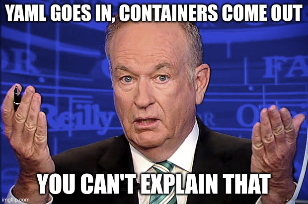
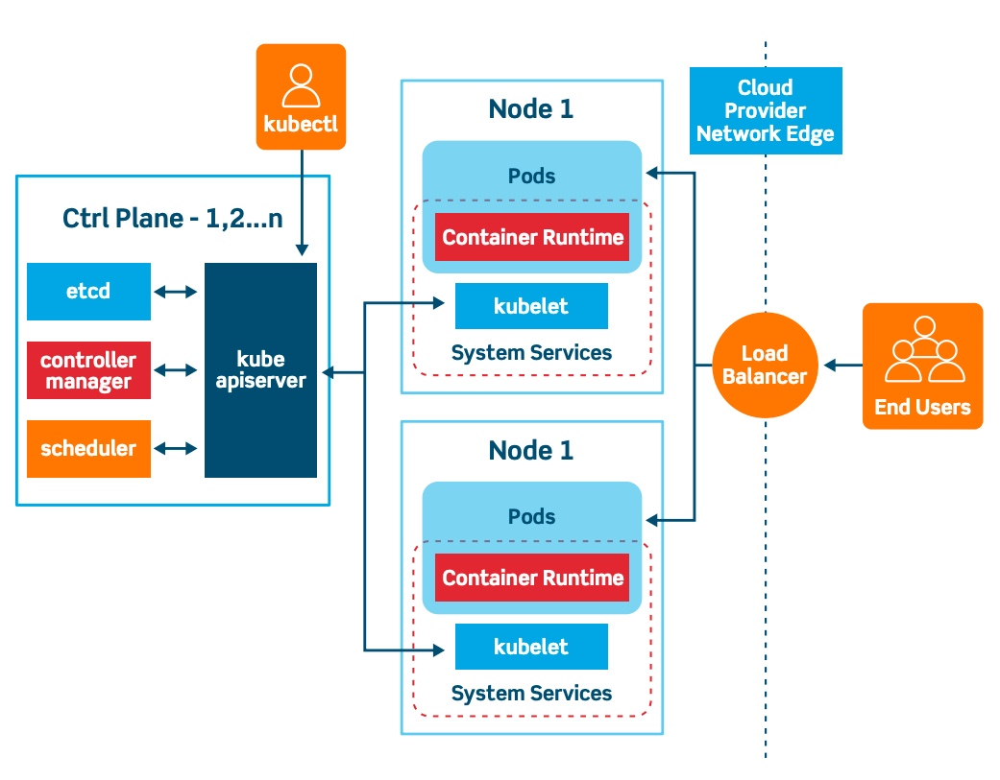

import Callout from '@components/Callout.astro';

[Postgres Conference Seattle 2024](https://postgresconf.org/conferences/SEA2024) partnered up with [PASS](https://passdatacommunitysummit.com) this year to present a united database front. They accepted my "[Kubernetes Killed the High Availability Star](https://postgresconf.org/conferences/SEA2024/program/proposals/kubernetes-killed-the-high-availability-star-how-to-stop-worrying-and-embrace-postgres-in-the-cloud)" talk, which I graciously gave on the last day of the conference. The next talk in that room wasn't for another hour, so I had plenty of time to talk shop with attendees, about the future of Postgres, high availability, and Kubernetes in general.

If you weren't there and missed out on the fun, this is your chance to catch up and enjoy a few of my notorious bad puns along the way. Let me tell you why the concept of Postgres HA is dead.

For those of you who want to watch instead of read, here's the video of the talk itself in all of its glory:

[Video link]()

## High Availability in peril

I've been working specifically with Postgres High Availability since 2011. I gave my first High Availability talk at [Postgres Open 2012](https://wiki.postgresql.org/wiki/Postgres_Open_2012), titled "High Availability with PostgreSQL and Pacemaker". That same stack played a significant role in the first edition of my PostgreSQL High Availability Cookbook and survived until the [third edition](https://www.packtpub.com/en-us/product/postgresql-high-availability-cookbook-9781787125537). Were I to continue that series, I'd remove both chapters dedicated to that stack and replace them with nothing.

But I won't continue that series because Postgres HA is dead, and Kubernetes killed it.

It's a bold claim, but not one without evidence. Allow me to explain how and why that happened, and perhaps more to the point, why it _should_ happen.

## Postgres HA is hard

Let's just face the facts: Postgres HA is hard. Very hard. How hard?


And so the next question may be... but why? Why would Postgres HA be so difficult? The primary reason for this is that **Postgres is really just a big bag of tools**, and it expects end users to cobble together something useful out of them.

Nearly every Postgres HA stack uses one of these utilities:

* `pg_basebackup` - build replicas
* `pg_rewind` - “Fix” old Primary nodes
* `pg_ctl` - start / stop Postgres

But that's not quite enough, is it? It's also necessary to know _how_ and _when_ to use these utilities, what to do before and afterwards, how to determine when to intervene, and a plethora of other theoretical concepts and frameworks, such as:

* [Quorum](https://en.wikipedia.org/wiki/Quorum_%28distributed_computing%29)
* [Sync / async Replication](https://www.postgresql.org/docs/current/runtime-config-replication.html)
* [Split-brain](https://en.wikipedia.org/wiki/Split-brain)
* [Network Partition](https://en.wikipedia.org/wiki/Network_partition)
* [Fencing](https://en.wikipedia.org/wiki/Fencing_\(computing\))
* [CAP theorem](https://en.wikipedia.org/wiki/CAP_theorem) / [PACELC theorem](https://en.wikipedia.org/wiki/PACELC_theorem)

Familiarity with all of those frameworks is a _minimum_ requirement; mastery is necessary to avoid unforeseen edge-cases that can reduce a working cluster to a smoking ruin.

To avoid that, most DBAs just use one of the existing Postgres HA software stacks instead. But that presents a new conundrum: which one? Let's examine a _partial_ list in no particular order:

* [repmgr](https://www.repmgr.org)
* [pg_auto_failover](https://pg-auto-failover.readthedocs.io/en/main/)
* [Patroni](https://patroni.readthedocs.io/en/latest/)
* [Stolon](https://sgotti.dev/post/stolon-introduction/)
* [EDB Failover Manager (EFM)](https://www.enterprisedb.com/docs/efm/latest/)
* [EDB Postgres Distributed (PGD)](https://www.enterprisedb.com/products/edb-postgres-distributed)
* [Bucardo](https://bucardo.org/Bucardo/)

Which one of these should a DBA use? They each have their strengths and weaknesses, some will automatically build replicas while others won't. They each have their own system for health checks, maintaining quorum, failover evaluation, and so on. Unless the decision is rather arbitrary, a certain familiarity with the Postgres ecosystem is necessary to even understand which direction to turn. It's the classic [paradox of choice](https://en.wikipedia.org/wiki/The_Paradox_of_Choice), but with HA stacks.

That's not even the end of the choices to make. Consider some of the pools and proxies for connection routing:

* [PGBouncer](https://www.pgbouncer.org/)
* [PgPool-II](https://www.pgpool.net/)
* [PgCat](https://github.com/postgresml/pgcat)
* [Odyssey](https://github.com/yandex/odyssey)
* [Supavisor](https://github.com/supabase/supavisor)

<Callout variant="Info">
PgPool-II can also be used as a HA tool, but most professionals advise against this and recommend using it purely as a proxy.
</Callout>

Oh, and we can't forget about managing backups:

* [Barman](https://pgbarman.org)
* [pgBackRest](https://pgbackrest.org)
* [WAL-G](https://wal-g.readthedocs.io/PostgreSQL/)
* [pg_probackup](https://github.com/postgrespro/pg_probackup)

This wasn't a problem in 2011 when I sought to design a highly available Postgres cluster, but that was a long time ago. All of these tools were designed by professional consultants backed by well-known Postgres-focused companies, battle-tested in hundreds or thousands of client deployments and refined over several years.

In the end, using any of them is _probably_ fine, but there are still several choices, configuration, testing, and deployment phases ahead. In other words, you _still_ have to put everything together.


I hope you have time to:

* Configure each server
* Build each replica
* Activate the HA stack
* Design the access topography
* Account for edge cases
* Document the entire design for other team members
* Build playbooks for various outage scenarios
* Test everything
* Cross your fingers

It's not _quite_ as bad as writing the entire software suite yourself, but it's hardly easy or risk-free either.

## Enough complaining, what's the solution?

But like I said, all of these HA stacks have been around for a long time now, and a certain consensus has emerged over the years. All of the Cool Kids now say: Just use Patroni. There's a good reason for this, as it's one of the best Postgres HA automation stacks out there, as well as one of the safest with inescapable quorum and node fencing as part of the inherent design.

So let's do that. Let's just go ahead and put together a quick and easy Patroni cluster. All we need to do is...

1. Create three VMs.
2. Install all of the software.
3. Configure etcd.
4. Configure Patroni.
5. Configure HAProxy.

Oh, and we have to do all of that a minimum of three times. Much of this _can_ be scripted, but the first time likely won't be. We need to build a functional understanding of the entire stack before unleashing an automated deployment system that puts together a bunch of parts, right?

Additionally, we can't make any mistakes while doing it. Maybe the cluster won't work as intended, or maybe it'll _look_ as if it is, but contains some subtle typo that fundamentally transforms the operating assumptions in unknowable ways. Copious testing will catch most or even all of these, but relies on due diligence and the [halting problem](https://en.wikipedia.org/wiki/Halting_problem).

You can't catch every bug though, and the setup works for all of the obvious scenarios you've tested. Let's just assume we did everything right, it's all working as intended, and we've properly interpreted the Patroni documentation for proper setup, deployment, and operation for all of the functional components.

How long did that take? How many manuals did you have to read? How much software installed and configured? How many times did it break before it _mostly_ worked? How many times did you have to tear down the whole cluster and start over because of some missed step? Patroni is great software, but relies on no less than two _other_ pieces of completely unrelated software that you also need to understand.

There's a reason that so many Postgres consulting companies exist. That's a lot of expertise for something as fundamental and necessary as "simple" high availability. I've personally designed clusters and deployment playbooks for dozens of companies, and they're grateful every single time because they _really_ don't want to do it themselves.

Oh... oh! We also forgot to set up all of this other stuff:

* A pooler, because HAProxy is just for routing to the primary.
* Backup, because that's not built into Patroni itself.
* A monitoring stack like [Prometheus](https://prometheus.io)
* Log capture and aggregation such as [Elasticsearch](https://www.elastic.co/elasticsearch)

Forget it, I give up.

## Just kidding! This works better

Luckily, engineers have _felt this_ down to their very bones, and some time in the last 20 years, [Kubernetes](https://kubernetes.io/) was born. When combined with an operator such as [CloudNativePG](https://cloudnative-pg.io), you no longer need a degree in cluster engineering to keep your database online.



Kubernetes provides a lot of boilerplate architecture and functionality to make "infrastructure as code" a reality. One of the ways that happens is through [Operators](https://kubernetes.io/docs/concepts/extend-kubernetes/operator/). When it comes to Postgres, you can basically think of an operator as a "DBA in a box".

It's like [docker compose](https://docs.docker.com/compose/), but... more so.

The point is that it's fully intent-based (declarative) deployment. You describe what you want, define limits on resources it should consume, which software should be involved, and that's it. Kubernetes maintains a continuous reconciliation loop that will go _out of its way_ to make sure it satisfies the provided definition. The operator is the tool it uses for that work.

For those curious at the various parts of Kubernetes, here's a pretty good diagram:



There's a lot, but it really boils down to four things:

1. **The Control Plane** which maintains state and coordinates everything. It's usually a quorum of three or more nodes that agree on what the cluster looks like and what it should be doing.
2. **Worker Nodes** where everything runs. Resources, storage, jobs, everything lives here. There's some subtlety here, but we can ignore that for now.
3. **Compute** are GPU, CPU, RAM, and other hardware resources available to containers running in the cluster. These are meant to be ephemeral and can be supplied by any node in the cluster. When services mention "autoscaling", it's because they can spin up as many containers with compute resources as necessary to react to request load.
4. **Storage** is the one semi-stable resource assigned to containers. There are numerous cluster-aware distributed storage systems that run natively within Kubernetes, but sometimes the storage is purely a persistent reference to some external API such as [S3](https://aws.amazon.com/s3/).

Kubernetes uses all of those elements to give users what they ask for. A bit like Yoda, it's either do, or do not; there is no "try". Kubernetes is a medium much like The Force, if you're brave enough to wield it.


Due to all of this, it's possible to have a _one node cluster_. How is that possible? Because container restarts are frequently faster than failover detection. Was the contanier corrupted? Who cares! Kubernetes will make another to replace it, possibly on another worker node entirely. So long as the data is still available, that's all it needs.

Quorum? That's built into the Kubernetes control plane, so you don't need to maintain your own quorum layer. Connection routing? There's only one node, so that's easy to do by routing all connection requests to that container, wherever it is. It's very convenient and "easy" to do with pure Kubernetes and a Postgres image.

What about two nodes? That's where things start to get a bit complicated. By itself, Kubernetes can't answer _any_ of these questions:

* Which node is the primary?
* How do failovers work?
* What about making replicas?
* And proper backups?
* Where should connections go?

It's not a Postgres DBA and has no idea how Postgres itself works internally, externally, physically, or theoretically. It would let you create two Postgres nodes, but aside from keeping them online at all costs, it would have no idea what to do with them.

And this is why Operators exist. Kubernetes Operators like CloudNativePG provide functionality that would not be available otherwise. Need extra nodes? Change one configuration value and it makes more. Backups and restores? Add a short stanza and it's all automated. Connection pool? It'll set up PgBouncer properly like a pro. Node routing? How about three services for write, read-write, and read-only routes? Monitoring and logging? How about a whole [OpenTelemetry](https://opentelemetry.io/) API for direct integration into Prometheus and Grafana?

It provides a seemingly endless litany of features only the most practiced DBAs could hope to juggle, and does it with a cluster definition that looks like this:

```yaml
apiVersion: postgresql.cnpg.io/v1
kind: Cluster
metadata:
  name: cluster-example
spec:
  instances: 3

  storage:
    size: 100Gi
```

That's a real, functional cluster definition which creates three Postgres nodes with one primary and two replicas, each with 100GB of disk space. It'll handle failover,  build or delete nodes to match the amount of instances, and everything else we mentioned previously. Configuration can obviously get a lot more complicated if we want specialized storage, backups stored in S3, connection pools, and other tweaks. But the basics are all there with that minuscule definition.

## Why bother with HA?

Just keep these three points in mind when interacting with a Kubernetes cluster:

1. Nodes are ephemeral - don't care about your hardware, it can be replaced.
2. Declarative focuses on _results_ - ask for what you want, and you'll get it.
3. Only storage matters - you can mount storage to almost anything, act like it.

This opens up a _whole new world_ of possibilities. Want to upgrade your hardware or to the latest Postgres minor version? The operator will shut down each replica and start it again with the new definition or system image, and finally end with the Primary. Need to deploy 20 nodes instead of 3? Just change a single value.

There's no more hardware to manage. Architecture is no longer a concern. There's still work for a DBA to do, but it can be focused on Postgres internals rather than juggling all of the innumerable infrastructure and operational components as well. You can be a Postgres DBA rather than also moonlight as a system administrator.

For those still running Postgres clusters on bare metal, the tried and true techniques will still work. My book and numerous blogs exist for easing cluster setup, and consultants are always willing to help in a pinch. But if you can fold those systems into a local Kubernetes cluster as worker nodes, it might be time to consider doing so.

## Other Operators

As a final note, CloudNativePG isn't the _only_ Postgres-specific Kubernetes operator out there, but I personally consider it the best, and our own [Tembo operator](/blog/tembo-operator) even leverages it for cluster management. It's also the only operator that isn't a wrapper for Patroni, electing to tie directly into Kubernetes systems instead. That's why they put "Native" in the name. 

Regardless, there are other operators to investigate:

* [Zalando Postgres Operator](https://github.com/zalando/postgres-operator)
* [Crunchy Postgres Operator](https://github.com/CrunchyData/postgres-operator
* [Percona Postgres Operator](https://github.com/percona/percona-postgresql-operator)
* [StackGres](https://stackgres.io/)
* [KubeDB](https://kubedb.com/)

So pick up an operator and give Kubernetes a shot; you'll be glad you did!
