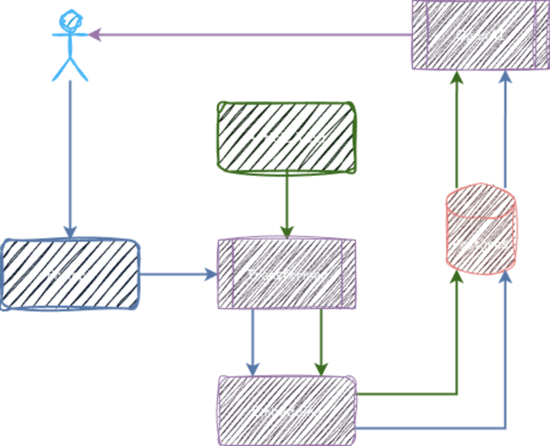

import Callout from '@components/Callout.astro';

[Postgres Conference Seattle 2024](https://postgresconf.org/conferences/SEA2024) partnered up with [PASS](https://passdatacommunitysummit.com) this year to present a united database front. They accepted my "[What's our Vector, Victor?](https://postgresconf.org/conferences/SEA2024/program/proposals/what-s-our-vector-victor)" talk, which I graciously gave on the first day of the conference.

If you weren't there and missed out on the fun, this is your chance to catch up and maybe get a bit more information that was cut for length. Let me tell you why RAG is the future, and how Postgres and [pg_vectorize](https://github.com/tembo-io/pg_vectorize) make it a reality.

For those of you who want to watch instead of read, here's the video of the talk itself in all of its glory:

[Video link]()

<Callout variant="Info">
For those unaware, the title of this talk is a reference to a line from the movie [Airplane!](https://www.imdb.com/title/tt0080339/) It's a film comprised almost entirely of puns and sight gags, much like my conference talks.
</Callout>

## What is AI?

Before we start trying to build AI systems, we need to define our vocabulary and the problem-space. Maybe this is the picture in your head when thinking about the current state of AI:


Fortunately or unfortunately, that's not quite right. It's one thing to say something is "just math", because if we get technical, anything involving a computer boils down to computations. This time it's actually true! Modern AIs really are just math, with a bit of probability mixed in for variance.

This is the truth of the matter:


I won't go too far into the fundamentals here, as it's beyond the scope of this talk, but we'll need some basis of moving on. So let's define a few terms which frame AI and how Postgres fits in.

* **[LLM](https://en.wikipedia.org/wiki/Large_language_model) - Large Language Model**  
  This is where the AI "lives". How its produced, what it contains, and how it works are generally immaterial. It can be a black box for now.
* **[RAG](https://en.wikipedia.org/wiki/Retrieval-augmented_generation) - Retrieval Augmented Generation**  
  Language models are "trained" on various sources, but operate entirely based on probability. They tend to mix things up and sound _very_ convincing about it. One way to combat that is to give them hard fact references which must be included in an answer. This is where Postgres comes in.
* **[Token](https://itsfoss.com/llm-token/) - A word chunk**  
  Word stemming is how most language systems function. Consider the word "cat", it could be left as-is, or be catacomb, cataclysm, catastrophe, catchy, and so on. The frequency of the tokens in training material determine how likely each token will be in a result. If you ask an LLM about felines, it's far more inclined to answer about cats than a catastrophe, unless you asked it to tell a story about a particularly destructive animal.
* **[Embedding](https://en.wikipedia.org/wiki/Word_embedding) - Vector of Token Coordinates**  
  How is a token or sentence related to all of the other tokens as a model is trained to understand them? This ends up being a _massive_ array of hundreds or even thousands of coordinates. Remember how we said AI was just math? But how do we obtain such vector coordinate arrays?
* **[Transformer](https://en.wikipedia.org/wiki/Transformer_\(deep_learning_architecture\)) - Translates text into embeddings**  
  Why, from a sentence transformer, of course. These are basically "mini" LLMs built specifically to deterministically translate some amount of text into a vector array. If you collect several of these, their coordinate proximity determines their similarity. That's how semantic search works in a nutshell. The intent or meaning of the text is compared rather than the literal words. What do databases do _really well_? Hopefully you can see where this is going.

It all ends up as a coordinate space like this:


A vector isn't just the location of each individual fish in a three-dimensional plane. It's the location of the fish, its species, coloring, fin position, directional velocity, drift, its most recent meal, whether or not it's in a school, and so on. It's all of the _metadata_ about the fish, implicitly encoded into what amounts to a holographic mapping. Every vector defines and affects every other vector, and with hundreds or thousands of coordinates to work with, do so with incredibly high fidelity.

So where do Postgres and the `pg_vectorize` extension come in?

## What does pg_vectorize do?

In a way, it brings AI to the masses. The [pgvector](https://github.com/pgvector/pgvector) extension provides native vector storage and manipulation capabilities to Postgres, including some advanced vector-specific indexing techniques. But that alone is not quite enough to build an AI tool.

Let's examine some of the basic functionality of `pg_vectorize`.

### Transform individual phrases

Remember what we said about embeddings? It's one thing to know what they are and how they work, and another entirely to produce and leverage them. We need to find a transformer or service such as [OpenAI](https://openai.com/), interface with that API, transmit the text to the service, and finally save the result in Postgres or use it in a search.

Or we can just execute a function in Postgres. This example would transform the sentence "Is Postgres the best database engine?" into a vector embedding. We could either store it, or compare it against other embeddings for similarity.

```sql
SELECT vectorize.encode(
  input       => 'Is Postgres the best database engine?',
  model_name  => 'sentence-transformers/all-MiniLM-L12-v2'
);
```

### Create and maintain embeddings

We can also go one level beyond that, and build embeddings for the contents of an entire table. After all, we need to compare incoming embeddings to _something_, don't we?

This example will produce _and maintain_ vector embeddings for the author, title, and content fields in a blog table. Consider our earlier question, "Is Postgres the best database engine?" We can compare that resulting embedding to all of the articles in our corpus, and the nearest match is probably a good answer.

```sql
SELECT vectorize.table(
  job_name     => 'rt_article_embed',
  "table"      => 'blog_article',
  primary_key  => 'article_id',
  update_col   => 'last_updated',
  columns      => ARRAY['author', 'title', 'content'],
  transformer  => 'sentence-transformers/all-MiniLM-L12-v2',
  schedule     => 'realtime'
);
```

We now have the minimum pieces for semantic search, and we're still not done.

<Callout variant="Info">
The `realtime` scheduler spawns a [PGMQ](https://github.com/tembo-io/pgmq) entry for existing rows, and each new insert or update. Calculating embeddings is fairly slow, and a queue means writes incur much less latency because `pg_vectorize` builds the embedding asynchronously. It's also possible to use [pg_cron](https://github.com/citusdata/pg_cron) syntax to refresh embeddings on a schedule.
</Callout>

### Natural language search

To avoid affecting the underlying table, `pg_vectorize` maintains entirely separate tables where it stores associated embeddings. This is good practice in any case, as storing a bunch of thousand-array vectors inline with our data isn't ideal. Regardless, rather than seek out those specific embedding tables for searching, why not let the extension handle it?

Let's ask it our favorite question: "Is Postgres the best database engine?"

```sql
SELECT * FROM vectorize.search(
  job_name        => 'rt_article_embed',
  query           => 'Is Postgres the best database engine?',
  return_columns  => ARRAY['author', 'title', 'content'],
  num_results     => 5
);
```

So long as the `job_name` parameter matches a previously defined table embedding job, the query is transformed to a compatible vector and compared to the stored embeddings. We asked for five results, and we'll get five rows from the underlying `blog_article` table which best matched the question.

Now we have _all_ of the parts of a semantic natural language search, and we don't really need to know much about LLMs or how they work. Yet `pg_vectorize` still has a couple tricks up its sleeves.

### Perform a RAG request

Remember, LLMs are notoriously and frequently inaccurate, prone to completely arbitrary hallucinations. That's a side-effect of essentially operating as giant sentient word clouds. But what if we performed a search against embeddings stored in Postgres to find legitimate references and fed that to the LLM along with the user question?

That's also built into `pg_vectorize`:

```sql
SELECT vectorize.rag(
  agent_name  => 'blog_chat',
  query       => 'Is Postgres the best database engine?',
  chat_model  => 'ollama/llama3.1'
) -> 'chat_response';
```

The LLM response and all of the references are included in the JSON result. Normally this kind of behavior would require dozens of lines of code.

### Multiple API compatibility

All of this functionality is available using `pg_vectorize`, but it does require external resources. There are two options:

Create an OpenAI account and obtain an API key. Then supply it as a configuration parameter to `pg_vectorize`:

```sql
ALTER SYSTEM SET vectorize.openai_key TO '<your api key>';
SELECT pg_reload_conf();
```

Alternatively, `pg_vectorize` can interface with other OpenAI API-compatible services. This includes popular servers like [vLLM](https://github.com/vllm-project/vllm) and [Ollama](https://ollama.com). Using these requires setting two parameters:

```sql
ALTER SYSTEM SET vectorize.openai_service_url 
   TO 'https://api.myserver.com/v1';

ALTER SYSTEM SET vectorize.embedding_service_url 
   TO 'https://api.myserver.com/v1';

SELECT pg_reload_conf();
```

The first specifies a full API URL for LLM-specific uses such as `vectorize.rag`, and the second is for creating and maintaining embeddings. As a result, it's possible to run a fully on-prem AI solution, or leverage any OpenAI competitor by simply calling SQL statements.

## Let's imagine a simple RAG application

As a final exercise, let's reexamine the conceptual structure of a RAG application.



From the data side, we need to perform these actions:

1. Gather content
2. Pass it through a transformer
3. Store vectors in Postgres

We can do that in advance in an initial bootstrap phase, and then continuously as new content arrives or receives updates.

From the user side, we need all of these steps:

1. User asks a question
2. Pass it through a transformer
3. Match against stored vectors
4. Question + Results sent to an LLM
5. Send answer to the user

Or from the perspective of `pg_vectorize`, we can just do this:

1. Parse and load the content and metadata into Postgres
2. Call `vectorize.table( … )` to maintain embeddings
3. Call `vectorize.rag( … )` for entire user interaction

Which process would you rather follow?

## A Place for blogs

Now we can finally produce something concrete. Consider an existing site full of blog articles. We might consider a very rudimentary table structure to store each article and its associated metadata.

```sql
CREATE TABLE blog_articles (
  article_id    BIGINT PRIMARY KEY GENERATED ALWAYS AS IDENTITY,
  author        TEXT,
  title         TEXT,
  content       TEXT,
  publish_date  DATE,
  last_updated  TIMESTAMPTZ NOT NULL DEFAULT now()
);
```

One lesson I learned early when building something like this is that LLMs and embeddings present two problems:

1. LLMs have very short context windows, sometimes as low as 8kb. If you try to supply them with endless text, they might just choke on it and either truncate the question or provide some kind of mangled response. Blogs are long!
2. Embeddings tend to be "lossy" due to their relatively small vector length, usually around 384 coordinates. If we try to distill an article consisting of dozens of paragraphs to a single vector, the transformer is likely to lose the gist of the content. Try to summarize Moby Dick in 400 words!

To solve both of those problems, it's common to split longer content into numerous "chunks". This Chunky Style approach is usually done at the paragraph level, but more sophisticated splitters may consider semantic meaning as part of the parsing process. Either way, we'll need somewhere to put all of these article blocks.

```sql
  CREATE TABLE blog_article_chunks (
  chunk_id      BIGINT PRIMARY KEY GENERATED ALWAYS AS IDENTITY,
  article_id    BIGINT NOT NULL REFERENCES blog_articles,
  chunk         TEXT,
  last_updated  TIMESTAMPTZ NOT NULL DEFAULT now()
);
```

And here's how a chunk splitter may look using Python:

```python
from langchain_text_splitters import RecursiveCharacterTextSplitter

splitter = RecursiveCharacterTextSplitter(
    separators = ["\n\n", "\n", ' ', '.', '```'],
    chunk_size = 500,
    chunk_overlap = 20,
    length_function = len,
    is_separator_regex = False
)

def chunk_content(content):
    return splitter.split_text(content)
```

The process used here is to _optionally_ split on whitespace, periods, or code blocks, while keeping the chunks around 500 characters. Allowing overlap means we might include surrounding context on smaller chunks, fixing problems with short paragraphs, intro sentences, and so on.

<Callout variant='Info'>
We encourage you to explore the topic of chunking in more depth. Techniques used here can dramatically affect transformer accuracy.
</Callout>

In any case, once the data is parsed and loaded, we just need to initialize the embedding maintenance.

```sql
SELECT vectorize.table(
  job_name     => 'blog_chat',
  "table"      => 'blog_article_chunks',
  primary_key  => 'chunk_id',
  update_col   => 'last_updated',
  columns      => ARRAY['chunk'],
  transformer  => 'sentence-transformers/all-MiniLM-L12-v2',
  schedule     => 'realtime'
);
```

If this looks familiar, that's because it's the same example we used to demonstrate `vectorize.table`, but now it's directed at the chunk table instead. Once all of the background jobs complete, we're immediately ready to start submitting RAG requests:

```sql
SELECT vectorize.rag(
  agent_name => 'blog_chat',
  query      => 'Is Postgres the best database engine?',
  chat_model => 'ollama/llama3.1'
) -> 'chat_response';
```

## Seeking answers

The corpus loaded as part of this demonstration included all 503 of my own personal blog articles dating back to 2001. And the answer in this case?

> Four times since 2017, it has won the DB-Engines "DBMS of the Year" award.

Indeed it has. Here's the relevant portion of the article:

> There are a _lot_ of database engines out there, of which Postgres is merely one of literally hundreds. Despite that, it has won the DB-Engines [DBMS of the Year](https://db-engines.com/en/blog_post/106) four times since 2017, and recently eclipsed MySQL in 2023 as the most popular according to [Stack Overflow](https://survey.stackoverflow.co/2023/).

Pay attention to how the answer itself is paraphrased. An LLM clearly parsed the content, summarized the intent, and delivered a concise answer based on the article, rather than whatever random nonsense it would have normally replied with. 

Heck, let's try it now. Here's what the same model said _without_ RAG to help it out:

> Postgres (also known as PostgreSQL) is an excellent database engine, but whether it's the "best" depends on your specific needs.

It then included several bullet points of strengths and weaknesses, contextualized what "best" means, and generally avoided being definitive. A laudable effort, but we at Tembo know the _true_ answer.

And _that_ is the power of Postgres. Anyone (like Tembo) can build an extension like `pg_vectorize` that gives it the ability to interact directly with various AI systems. It lets _anyone who can write SQL_ build chat bots, add semantic search to their product listings, and so much more.

Tembo invites all developers to spin up one of our [RAG stacks](/docs/product/stacks/ai/rag) and experiment; maybe you'll build the next big AI app!
