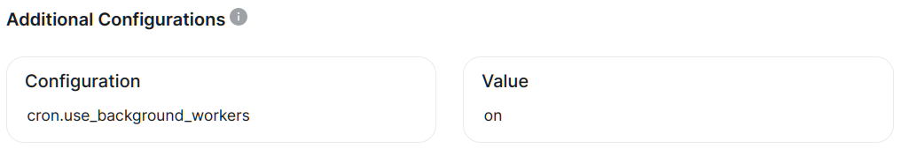

> _Run periodic jobs in PostgreSQL._

The `pg_cron` extension enables PostgreSQL to launch scheduled queries, functions, procedures, and other automated tasks using cron-like syntax.

## When should you use it?

This extension can be used if you're interested in executing scheduled tasks on a regular basis. This can encompass maintenance, processing jobs, or other background tasks which would normally require an external script or scheduling system to launch and track. For more information on how this extension works, please refer to the [official documentation](https://access.crunchydata.com/documentation/pg_cron/latest/).

## Example use case.

A new and exciting game company has written a game engine for managing virtual pets. As part of the game logic, users must regularly play with and feed their pets, and also allow them to rest. The company has decided to accomplish this by assigning credits representing how well trained, fed, and rested the pet is. These values should be decremented every hour, and as they get lower, pets exhibit visual changes to encourage player interaction.

## Example test script.

```sql
-- Create a table to hold pets

CREATE TABLE game_pets (
    pet_id      INT NOT NULL GENERATED ALWAYS AS IDENTITY PRIMARY KEY,
    owner_name  TEXT NOT NULL,
    pet_name    TEXT NOT NULL,
    trained     SMALLINT NOT NULL DEFAULT 24,
    fed         SMALLINT NOT NULL DEFAULT 24,
    rested      SMALLINT NOT NULL DEFAULT 24,
    birth_date  DATE NOT NULL DEFAULT CURRENT_DATE
);

-- Create a few pets and owners

INSERT INTO game_pets (owner_name, pet_name, birth_date) VALUES
    ('Mickey Mouse', 'Pluto', '1930-09-05'),
    ('Fred Jones', 'Scooby-Doo', '1969-09-13'),
    ('Jon Arbuckle', 'Garfield', '1978-07-08'),
    ('Charlie Brown', 'Snoopy', '1950-10-04');

-- Remove one unit of training, food, and rest from pets every hour.

SELECT cron.schedule(
  'reduce-pet-stats',
  '0 * * * *',
  $$
    UPDATE game_pets
       SET trained = greatest(trained - 1, 0),
           fed = greatest(fed - 1, 0),
           rested = greatest(rested - 1, 0)
     WHERE death_date IS NULL;
  $$
);

 schedule 
----------
        1

-- Check the status of the game schedule:

SELECT jobid, jobname, schedule, active FROM cron.job;

 jobid |     jobname      | schedule  | active 
-------+------------------+-----------+--------
     1 | reduce-pet-stats | 0 * * * * | t

SELECT jobid, status start_time, end_time FROM cron.job_run_details;

 jobid | start_time |           end_time            
-------+------------+-------------------------------
     1 | succeeded  | 2024-05-16 21:00:00.007664+00

-- Check the status of the pets after the job:

SELECT * FROM game_pets;

 pet_id |  owner_name   |  pet_name  | trained | fed | rested | birth_date |
--------+---------------+------------+---------+-----+--------+------------+
      1 | Mickey Mouse  | Pluto      |      23 |  23 |     23 | 1930-09-05 |
      2 | Fred Jones    | Scooby-Doo |      23 |  23 |     23 | 1969-09-13 |
      3 | Jon Arbuckle  | Garfield   |      23 |  23 |     23 | 1978-07-08 |
      4 | Charlie Brown | Snoopy     |      23 |  23 |     23 | 1950-10-04 |

-- Remove the job for some other method:

SELECT cron.unschedule('reduce-pet-stats');

 unschedule 
------------
 t
```

## Advanced usage: running jobs as other users

By default, the `pg_cron` extension will only successfully run jobs as the `postgres` user. To launch jobs as some other database user, a few extra steps are necessary.

### Enable background jobs in pg_cron

Use the following steps to make sure `pg_cron` use a background process when executing scheduled jobs:

- Navigate to **Settings -> Postgres -> Additional Configurations** in our [cloud interface](https://cloud.tembo.io/)
- Click **Add New**
- Set **Configuration** to `cron.use_background_workers`
- Set **Value** to `on`
- Make sure the dialog looks like this:
  
- Click **Save Changes**

### Test to make sure background jobs work properly

Use the following script or something similar to test that the alternate user can launch jobs successfully.

Execute this step as the `postgres` database user, or another superuser:

```sql
-- Grant usage to new user:

CREATE USER caretaker;
GRANT USAGE ON SCHEMA cron TO caretaker;
```

The following steps should be taken as the newly created user.

```sql
-- Create a test job that runs every 10 seconds:

SELECT cron.schedule('test-job-pg', '10 seconds', $$select 1$$);

-- Wait 10 seconds and then verify that job has run successfully:

SELECT pg_sleep(10);
SELECT jobid, command, status FROM cron.job_run_details;

 jobid | username  | command  |  status   
-------+-----------+----------+-----------
     1 | caretaker | select 1 | succeeded

-- Delete the test job:

SELECT cron.unschedule('test-job-pg');
```
