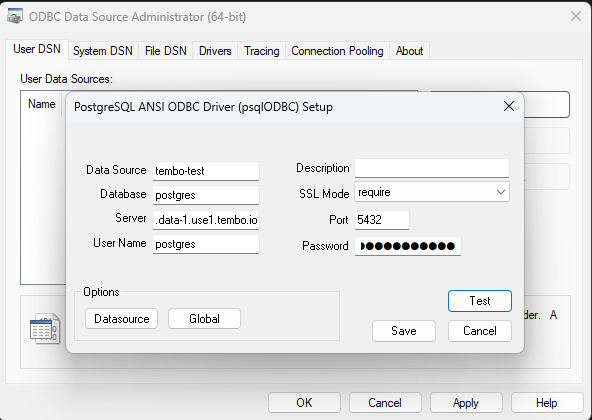

ODBC is a way to connect to data sources from Windows.

- **Open ODBC Data Source Administrator**, 64 bit (search to find in start menu). It should be installed by default on Windows.
- Under the **User DSN tab**, find and click **Add**
- For **Driver**, select **Postgres ANSI x64**. Version **14 or greater is required**. If you need to update your drivers, please find them linked from [here](https://odbc.postgresql.org/)
- Configure the settings for your connection, comparing to the below image. Note: use **sslmode 'require'**
- Click **test** to ensure your connection is successful

