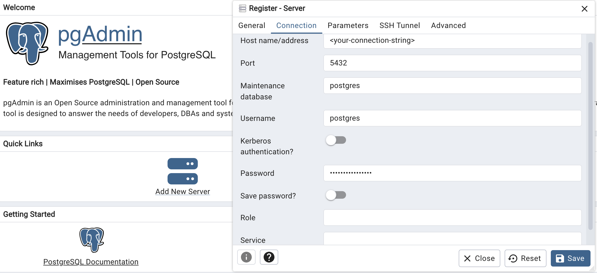

PgAdmin4 is a Postgres client that is supported on [numerous operating systems](https://www.pgadmin.org/download/).

- Open PgAdmin4 and within the Quick Links window, select **Add New Server**.
- Under the **General** tab, enter a name for your connection.
- Under the **Connection** tab, enter the following:
  - **Host name/address** - your Tembo Cloud instance hostname.
  - **Port** - your port number, by default this is **5432**.
  - **Maintenance database** - your database name, by default this is **postgres**.
  - **Username** - your username, by default this is **postgres**.
  - **Password** - your password.
- Under the **Parameters** tab, assure the following:
  - **Name** - **SSLmode**; Value - **require**.

