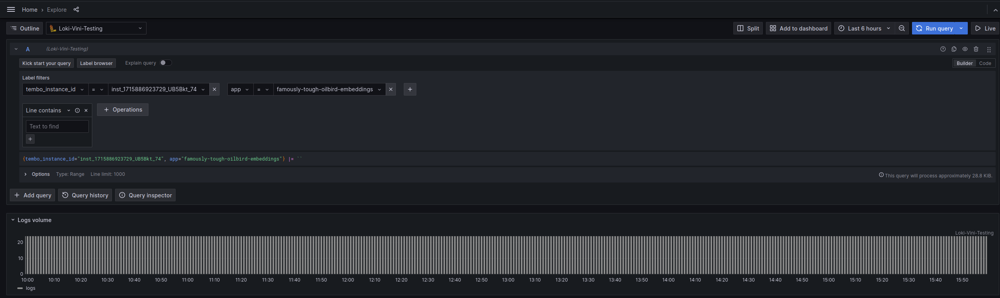

import Callout from '../../../../components/Callout.astro';

## Running low on storage

**Description:** The persistent volume associated with an instance is running out of storage space.

[Increase storage](/docs/product/cloud/configuration-and-management/increase-storage), or reduce data stored.

It's possible to use the following query to view data volume per Postgres database:

```sql
SELECT
  datname,
  pg_size_pretty(pg_database_size(datname))
FROM pg_database
WHERE datname NOT IN ('template0', 'template1')
GROUP BY datname;
```

Additionally, Write Ahead Log (WAL) files necessary for crash recovery will contribute to the total disk usage of the instance. Check the section on [Excessive WAL size](#excessive-wal-size) for more information.

## CPU throttling

**Description:** An instance is experiencing CPU throttling, which impacts performance.

[Increase instance size](/docs/product/cloud/configuration-and-management/increase-compute), or investigate and resolve the cause of high CPU.

To identify long running queries:

```sql
SELECT
  pid,
  now() - query_start AS duration,
  query,
  state
FROM pg_stat_activity
WHERE state != 'idle'
  AND now() - query_start > interval '5 minutes'
ORDER BY duration DESC;
```

Find which queries are using the most compute time with `pg_stat_statements`:

```sql
SELECT
  queryid,
  substr(query, 1, 50) AS query_snippet,
  calls,
  total_exec_time,
  mean_exec_time
FROM pg_stat_statements
ORDER BY total_exec_time DESC
LIMIT 10;
```

## High memory

**Description:** An instance is near the memory limit.

[Increase instance size](/docs/product/cloud/configuration-and-management/increase-compute), or investigate and resolve the cause of the high memory alert.

Postgres configuration parameters that significantly impact memory include `work_mem`, `maintenance_work_mem`, `shared_buffers`, and `max_connections`. You can find the value of a configuration with the `SHOW` command:

```sql
SHOW shared_buffers;
```

Tembo initially picks default values for these parameters based on your instance size and Stack. You can review and alter them in the instance's [Postgres Configuration](/docs/product/cloud/configuration-and-management/postgres-configuration) settings.

We also recommend consulting our [guide on optimizing Postgres memory usage](/blog/optimizing-memory-usage/)
for a more in-depth information regarding long-term management of Postgres memory usage.

## Backends waiting

**Description:** A backend process in an instance has been waiting for several minutes.

Find blocked queries:

```sql
SELECT
  activity.pid,
  activity.usename,
  activity.query,
  blocking.pid AS blocking_id,
  blocking.query AS blocking_query
FROM pg_stat_activity AS activity
JOIN pg_stat_activity AS blocking ON blocking.pid = ANY(pg_blocking_pids(activity.pid));
```

Find long running queries that may be blocking other queries:

```sql
SELECT
  pid,
  now() - query_start AS duration,
  query,
  state
FROM pg_stat_activity
WHERE state != 'idle'
  AND now() - query_start > interval '5 minutes'
ORDER BY duration DESC;
```

You can cancel a query like this:

```sql
select pg_cancel_backend(< pid goes here >);
```

The above will only cancel a running query, not any related transaction if one was created. Canceling a transaction requires terminating the user session itself, which can be done with the following query:

```sql
select pg_terminate_backend(< pid goes here >);
```

## FrozenXID

**Description:** An instance is at risk of transaction ID wraparound. When a critical threshold is reached, writes to the database will be locked until a **VACUUM FREEZE** can be completed.

Understand the cause of [transaction wraparound in Postgres](https://www.postgresql.org/docs/current/routine-vacuuming.html#VACUUM-FOR-WRAPAROUND). This occurs when postgres **VACUUM** cannot keep up with database activity.

Check how close each database is to the `autovacuum_freeze_max_age`:

```sql
SELECT
  datname,
  age(datfrozenxid) AS xid_age,
  current_setting('autovacuum_freeze_max_age') AS max_age
FROM pg_database
ORDER BY xid_age DESC;
```

This value is actually determined by the "oldest" table in that database. Tables can also be checked individually with this query:

```sql
SELECT
  relname AS table_name,
  age(relfrozenxid) AS xid_age,
  current_setting('autovacuum_freeze_max_age') AS max_age
FROM pg_class
WHERE relkind = 'r'
ORDER BY xid_age DESC
LIMIT 20;
```

Tables can be "frozen" individually to reset their XID threshold this way:

```sql
VACUUM FREEZE my_table;
```

It is not uncommon for one table to be much older than many others, making this a good way to spot-treat missed `VACUUM FREEZE` maintenance.

## Replication lag

**Description:** The standby server of an instance is lagging behind the primary server.

Investigate the replication lag by running the following query on the [standby server](/docs/product/cloud/configuration-and-management/read-from-standby):

```sql
SELECT now() - pg_last_xact_replay_timestamp() AS replication_lag;
```

One common cause for replication lag is long-running queries on the standby server. Please review [this document](/docs/product/cloud/configuration-and-management/read-from-standby) for a quick method to fix this.

Postgres replica servers also only apply streaming changes using a single process. Replicas often have different tables or indexes in local and filesystem cache than the blocks being applied from the primary system. As a result, extremely write-heavy primary servers can also "overload" a replica system by exceeding random disk throughput or the capabilities of the single apply process.

<Callout variant='info'>
	Postgres versions 15 and above will try to prefetch blocks that appear in
	the replication stream to reduce this effect.
</Callout>

If standby lag is a result of primary write volume, it may be necessary to [increase instance size](/docs/product/cloud/configuration-and-management/increase-compute) for better compute or storage performance.

## Deadlock conflicts

**Description:** There are deadlock conflicts in an instance, indicating contention and potential performance impact.

Find deadlocks for each database with this command:

```sql
SELECT
  datname AS database_name,
  deadlocks,
  blk_read_time,
  blk_write_time,
  stats_reset
FROM pg_stat_database;
```

Investigate locks:

```sql
SELECT
  locktype,
  database,
  relation::regclass AS relation,
  page,
  tuple,
  transactionid,
  pid,
  mode,
  granted,
FROM pg_locks
WHERE NOT granted;
```

Given the complexity of this view, we recommend referencing the [PostgreSQL pg_locks documentation](https://www.postgresql.org/docs/current/view-pg-locks.html).

## Failover detected

**Description:** A failover has been detected for an instance.

This problem will automatically resolve. The instance may have had a short period of being unavailable.

Check the transaction rate over time in your database on the instance dashboard, or the queries to your application in your application performance monitoring.

## Excessive WAL size

**Description:** The Write-Ahead Log (WAL) for an instance is using a significant percentage of available storage.

WAL files will generally use space up to the following value:

```sql
SHOW max_wal_size;
```

If replication slots are being used, these can prevent WAL files from being recycled if there is a disconnected standby, an inactive replication slot, or in certain other circumstances. If any disconnected or otherwise stuck or lagging replication slots are causing the alert, they can be found with this query:

```sql
SELECT
  slot_name,
  pg_size_pretty(
    pg_wal_lsn_diff(pg_current_wal_lsn(),
    restart_lsn)) AS slot_lag,
  active
FROM pg_replication_slots;
```

If this is a frequent problem, we recommend setting the `max_slot_wal_keep_size` parameter in [Postgres Configuration](/docs/product/cloud/configuration-and-management/postgres-configuration) settings to a non-zero value. This will drop slots at the specified size to prevent disk exhaustion.

It's also possible to manually drop a replication slot in an emergency situation:

```sql
SELECT pg_drop_replication_slot('< replication slot name here >');
```

<Callout variant='info'>
	Logical replicas or applications such as Debezium that depend on dropped
	slots may need to be restarted once a new slot is created.
</Callout>

## Workload crashing

**Description:** Tembo offers Apps as a way to run arbitrary workloads near your database, for example the [RestAPI](/docs/product/cloud/apps/rest-api) or [Embeddings](/docs/product/cloud/apps/embeddings), and more. This alert indicates that one of your Apps is crashing.

Check application logs:

Follow the [logging](/docs/product/cloud/logs) documentation to setup Grafana to view your logs. Once you have the new Data Source setup you will be able to search for logs using your `instance_id` and selecting your Tembo App from the `app` dropdown.



If you can't resolve the issue from looking at the logs, please contact our Support team by either joining our <a href="https://tembocommunity.slack.com" target="_blank" rel="noreferrer">Slack community</a>, emailing us at <a href="mailto:support@tembo.io">support@tembo.io</a>, or use the Intercom “message us” feature on our website. We respond to most messages within 24 hours (and often faster!)
