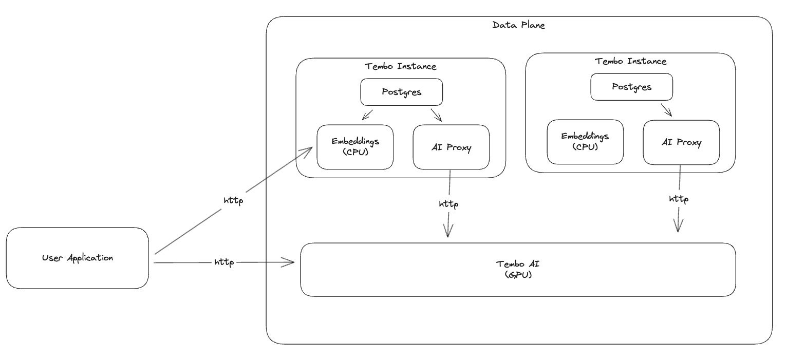

import Callout from '../../../../../components/Callout.astro';

<Callout variant='info'>
	**Tembo AI is currently in public alpha**
</Callout>

Tembo AI is a managed hosting service for Large Language Models with an [OpenAI compliant API](https://platform.openai.com/docs/api-reference/chat/create).
 It hosts open source models on Tembo infrastructure which provides reduced network latency from your Postgres instances hosted on Tembo and enhanced privacy.

In Tembo Cloud, LLMs are a shared service that runs within the Tembo Cloud platform.
 There is one instance of Tembo AI per data-plane that is shared across all data-plane users.
 The service can be reached directly from SQL and from user's applications via HTTP.




## Activate Tembo AI

Tembo AI is available for all Tembo users with an [payment method](../billing) on file.
 Prices are listed on a per 1 million token rate.

| Model | per 1M input tokens | per 1M output tokens
| ------------------- | ---- | ---- |
| meta-llama/Meta-Llama-3-8B-Instruct  | $0.15 | $0.45


### Via UI

You can enable Tembo AI by navigating to "Apps", then "AI". Click "Activate" to enable Tembo AI.

### Via API

You can also enable Tembo AI by using the Tembo Platform API.
 First, you will need to generate an API token so that you can communicate with the Tembo platform API.
 Navigate to cloud.tembo.io/generate-jwt and follow the instructions to generate a token.
 Alternatively, you can follow the instructions [here](/docs/development/api).

Set your Tembo token as an environment variable, along with your organization id and the Tembo instance id. Fetch the `TEMBO_DATA_DOMAIN` from the "Host" parameter of your Tembo instance.

```bash
export TEMBO_TOKEN=<your token>
export TEMBO_ORG=<your organization id>
export TEMBO_INST_ID=<your instance id>
export TEMBO_INST_NAME=<your instance name>
export TEMBO_DATA_DOMAIN=<you Tembo domain>
```

Patch your existing Tembo instance using the [Tembo Cloud Platform API](https://api.tembo.io/redoc) to enable the AI API. We'll set the the configurations to `None` so that the defaults are assigned.

Python:

```py
import requests

TEMBO_ORG = os.environ["TEMBO_ORG"]
TEMBO_INST = os.environ["TEMBO_INST"]
TEMBO_TOKEN = os.environ["TEMBO_TOKEN"]

resp = requests.patch(
    url=f"https://api.tembo.io/api/v1/orgs/{TEMBO_ORG}/instances/{TEMBO_INST}",
    headers={"Authorization": f"Bearer {TEMBO_TOKEN}"},
    json={
        "app_services": [
            {"ai-proxy": None},
        ]
    }
)
```

Curl:

```bash
curl -X PATCH \
  -H "Authorization: Bearer ${TEMBO_TOKEN}" \
  -H "Content-Type: application/json" \
  -d '{"app_services": [{"ai-proxy": null}]}' \
  "https://api.tembo.io/api/v1/orgs/${TEMBO_ORG}/instances/${TEMBO_INST}"
```

## Use Tembo AI

Tembo AI supports the following models:
    - [Meta-Llama-3-70B-Instruct](https://huggingface.co/meta-llama/Meta-Llama-3-70B-Instruct)


You can call Tembo AI directly with an HTTP requests and from SQL.

### Via HTTP


```bash
curl -X POST https://verbally-truthful-lionfish.data-1.use1.tembo.io/ai/v1/chat/completions \
-H "Content-Type: application/json" \
-H "Authorization: Bearer $YOUR_AUTH_TOKEN" \
-d '{
  "model": "meta-llama/Meta-Llama-3-8B-Instruct",
  "messages": [{"role": "user", "content": "Tell me the difference between a cat and a dog in 1 sentence"}]
}'
```

```json
{
  "choices": [
    {
      "finish_reason": "stop",
      "index": 0,
      "logprobs": null,
      "message": {
        "content": "The main difference between a cat and a dog is that cats are generally more independent and aloof, preferring to spend time alone, whereas dogs are often more social and pack-oriented, thriving on interaction and attention from their human family members.",
        "role": "assistant"
      },
      "stop_reason": null
    }
  ],
  "created": 1720798146,
  "id": "cmpl-6e54ff8832ee48a294f10dbcb6a4b1ae",
  "model": "meta-llama/Meta-Llama-3-8B-Instruct",
  "object": "chat.completion",
  "usage": {
    "completion_tokens": 48,
    "prompt_tokens": 25,
    "total_tokens": 73
  }
}
```

### Via sql

Use `pg_vectorize` to call the chat completions endpoint.
 Note the `tembo/` prefix to the model name, which tells pg_vectorize where to route the request.


```sql
CREATE EXTENSION pg_vectorize CASCADE;

select vectorize.generate(
  input => 'Tell me the difference between a cat and a dog in 1 sentence',
  model => 'tembo/meta-llama/Meta-Llama-3-8B-Instruct'
);
```

```plaintext
                                                 generate                                                  
-----------------------------------------------------------------------------------------------------------
 Cats are generally more independent and solitary, while dogs tend to be more social and loyal companions.
(1 row)
```
