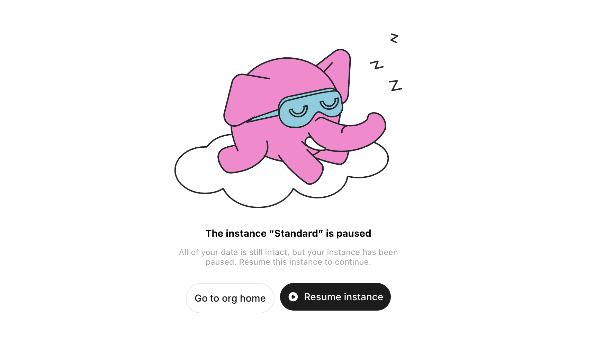

import Callout from '../../../../../components/Callout.astro';

## What is Auto-pause?

Auto-pause is a feature in Tembo Cloud designed to automatically pause instances that have been idle for a certain period. This feature helps reduce resource consumption and costs, especially for instances that experience infrequent use.

For **hobby (non-paid) instances**, Auto-pause is **always enabled by default** and cannot be turned off. This ensures that hobby instances stay cost-efficient by automatically pausing when they are idle.

An instance is considered idle if it meets all of the following conditions:
- The instance is older than two days.
- There have been no connections to the instance for over a day.
- The instance has not been manually resumed within the last day.

<Callout variant='info'>
  Auto-pause is ideal for non-critical workloads or development environments where continuous uptime is not essential.
</Callout>

## Auto-pause for Paid Instances

For paid instances, Auto-pause is **optional** and not enabled by default. Paid instances are configured to maintain high availability and continuous uptime unless Auto-pause is explicitly enabled. However, you can choose to enable Auto-pause to optimize costs by reducing resource usage when the instance is idle.

<Callout variant='warning'>
  When paid instances are paused, you will still be charged for storage.
</Callout>

### How to Enable Auto-pause for Paid Instances

Follow these steps to enable Auto-pause for paid instances:

1. Navigate to the **Instance** tab of your Instance's Settings.
2. Go to the **Auto-pause** section and toggle the **Auto-pause** option to **ON**.
3. Save the changes to apply the configuration.