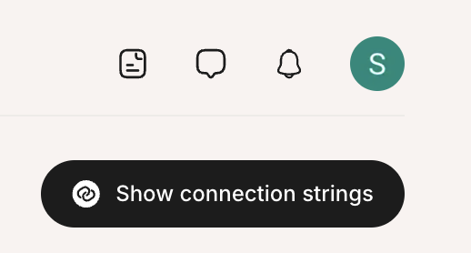
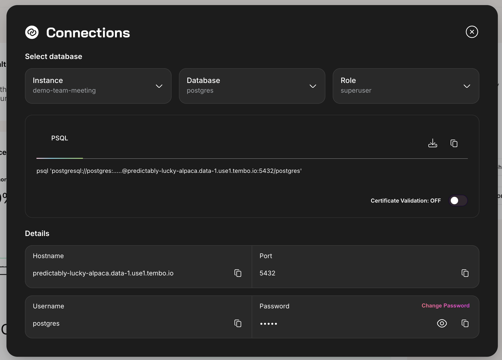

To connect to a Tembo Cloud instance, select the Tembo Cloud instance in the Organization home dashboard, then click the **Show connection strings** button in the top right corner, under your profile icon.

This will open the connection strings window. Connect to Postgres using the credentials found in this window.

Tembo provides a list of guides for connecting to Postgres in different client programs. If you're just getting started, you can try [PgAdmin](/docs/getting-started/quickstarts/database-clients-and-tools/pgadmin4) for a GUI or [psql](/docs/getting-started/quickstarts/database-clients-and-tools/libpq) for a CLI.

Tembo manages the **postgres** and **readonly** users, which are visible in this window. You may also self-manage custom Postgres users, but those credentials don't show up in this window.

For instances with [High Availability](/docs/product/cloud/configuration-and-management/high-availability) enabled, you may also connect to your [standby server](/docs/product/cloud/configuration-and-management/read-from-standby).

If you have any trouble connecting to Tembo, please review our troubleshooting guide, or reach out to [Tembo Support](mailto:support@tembo.io).
