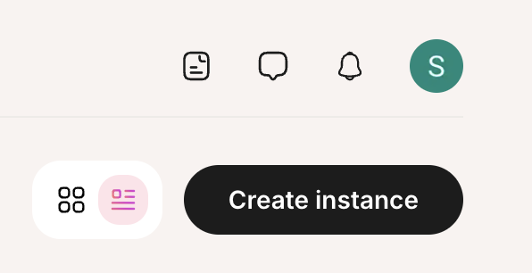
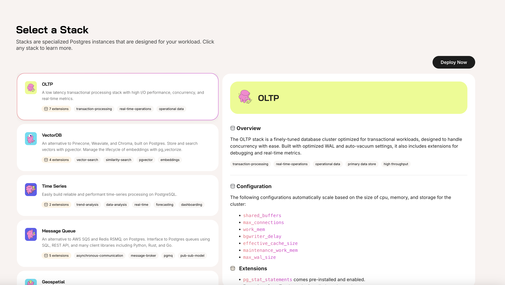
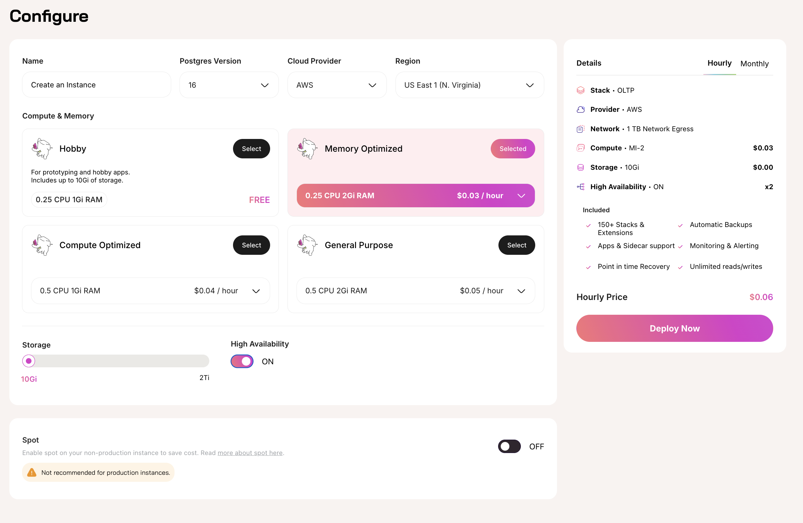

Create an instance by selecting the **Create Instance** button.

When creating an instance, first you will select a [Stack](/docs/product/stacks/intro-to-stacks).

After selecting your Stack, you will configure your instance for deployment.

Select from the available options to deploy your Tembo instance. For production use cases, it is recommended to deploy with [High Availability](/docs/product/cloud/configuration-and-management/high-availability) **enabled** and [Spot](/docs/product/cloud/configuration-and-management/spot-instances) **disabled**.

Review the pricing on the right side of the screen in the pricing summary window. Click between hourly and monthy summaries using the tabs in in the top of the window.

Click **Deploy Now** to deploy your Tembo instance.

After your instance is done deploying, you can connect to your Tembo Cloud instance using your [connection string](/docs/product/cloud/configuration-and-management/connect-to-instance).
