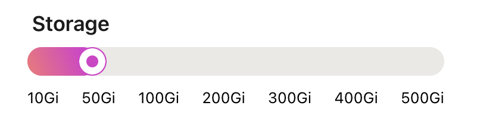

import Callout from '../../../../../components/Callout.astro';

### Via UI

Find in **Settings > Instance Settings**

<Callout variant='warning'>
	Tembo Cloud does not currently support decreasing storage, which is a
	[limitation of our block storage
	provider](https://repost.aws/knowledge-center/ebs-increase-decrease-volume-size).
</Callout>

Changes will only take effect after clicking **Save**. Increasing storage does not restart your database.



### Via API

First, you will need to generate an API token so that you can communicate with your Tembo instance. Navigate to [cloud.tembo.io/generate-jwt](https://cloud.tembo.io/generate-jwt) and follow the instructions to generate a token. Read more about the Tembo API and tokens [here](/docs/development/api).

Set your Tembo token as an environment variable, along with your organization id and the Tembo instance id. Fetch the `TEMBO_DATA_DOMAIN` from the "Host" parameter of your Tembo instance.

```bash
export TEMBO_TOKEN=<your token>
export TEMBO_ORG=<your organization id>
export TEMBO_INST=<your instance id>

curl -X PATCH \
	"https://api.tembo.io/api/v1/orgs/${TEMBO_ORG}/instances/${TEMBO_INST}" \
	-H "Content-Type: application/json" \
	-H "Authorization: Bearer ${TEMBO_TOKEN}" \
	-d '{ "storage": "50Gi" }'
```
