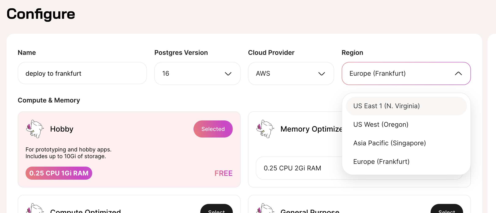

import Callout from '../../../../../components/Callout.astro';

## Deploying to Regions

With Tembo Cloud, you can deploy **Instances** to different **Regions**. When creating an **Instance**, pick a **Region** using the drop-down selector.

<Callout variant='info'>
	Don't see the **Region** or **Provider** that you want? Please email [support@tembo.io](mailto:support@tembo.io), and we can help!
</Callout>



Tembo plans to allow users to deploy to different **Providers**, but currently only Amazon Web Services (AWS) is available.

<Callout variant='warning'>
	After deploying an **Instance**, the **Region** cannot be changed.
</Callout>

## API

When using the [Tembo API](/docs/development/api), **Providers** and **Regions** are represented as **Dataplanes**. **Dataplanes** are where **Instances** are hosted. A **Dataplane** is uniquely identified by `provider_id`, `region_id`, and `index`.

Here is a sample of a **Dataplane** returned by the Tembo Cloud API. For more information, please check the [interactive API documentation](https://api.tembo.io/swagger-ui/#/dataplane/get_all_dataplanes).

```json
  {
    "index": "data-1",
    "provider_id": "aws",
    "provider_name": "AWS",
    "region": "us-east-1",
    "region_id": "use1",
    "region_name": "US East 1 (N. Virginia)"
  }
```

When you create an **Instance**, you may specify the **Provider** and **Region** using `provider_id` and `region_id`. Tembo decides which `index` to deploy your **Instance** into. By default, instances are deployed to `aws`, `use1`.

Some queries to Tembo's APIs involves fetching private data from your **Instance**, for example [Logs](/docs/product/cloud/troubleshooting/logs), [Metrics](/docs/product/cloud/troubleshooting/metrics), and [Secrets](/docs/product/cloud/security/update-postgres-password). These queries go to the [Dataplane API](https://api.data-1.use1.tembo.io/redoc), which has a different domain name for each **Dataplane**. This model allows for more secure handling of sensitive information.

**Dataplane** API domain names are structured like this: `api.< index >.< region_id >.tembo.io`, for example [api.data-1.use1.tembo.io](https://api.data-1.use1.tembo.io/swagger-ui/#). In the future when **Providers** other than AWS are supported, we will include the `provider_id` in the domain name for **Providers** other than AWS.
