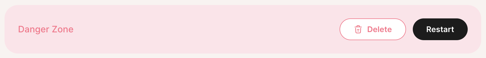

Find in **Settings > Instance Settings > (scroll to bottom) Danger Zone**



When you restart your instance, it will show **Restarting** in the Tembo Cloud UI. When done restarting, you instance will return to **Good**. It typically takes less than 30 seconds to restart.

You can check your instance has been restarted by checking when the server started:
```sql
SELECT pg_postmaster_start_time();
```
