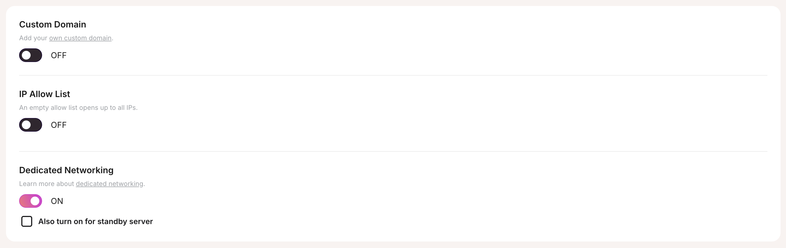

import Callout from '../../../../../components/Callout.astro';

## What is Dedicated Networking?

Dedicated Networking ensures your instance operates within an isolated network environment, offering enhanced security and optimized performance. By enabling this feature, you gain:

- **Network isolation**, which significantly enhances security by separating your instance from shared networks.
- **Performance improvements**, as Dedicated Networking allocates exclusive network resources to your instance, reducing latency and improving reliability.
- **Custom networking options**, including the ability to include a standby server for high availability if **High Availability** is enabled.

<Callout variant='info'>
  Dedicated Networking is highly recommended for production environments where security, performance, and uptime are critical.
</Callout>

## How to Enable Dedicated Networking

Follow these steps to enable Dedicated Networking for your instance:

1. Navigate to the **Network** tab in your instance's **Settings**.
2. Toggle the **Dedicated Networking** option to **ON**.
3. If you have **High Availability** enabled, you can also toggle **Standby Servers** to ensure your standby replica benefits from Dedicated Networking.
4. Save your changes to apply the configuration.

<Callout variant='warning'>
  Enabling Dedicated Networking incurs an additional cost of **$20/month** for each instance. If **Standby Servers** are enabled, the total cost is **$40/month** — $20 for the primary instance and $20 for the Replica.
</Callout>

