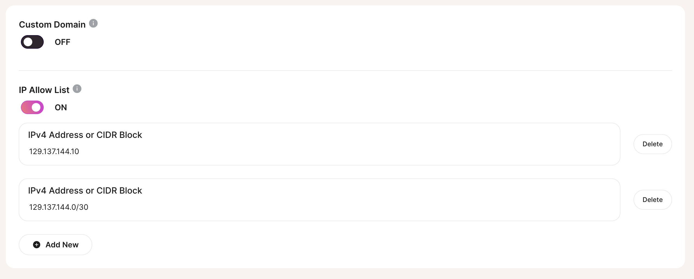

import Callout from '../../../../../components/Callout.astro';

Find in **Settings > Network Settings**

Toggle on this setting, then enter an IPv4 address or [IPv4 CIDR block](https://en.wikipedia.org/wiki/Classless_Inter-Domain_Routing), clicking **Add New** for each additional, allowed address.

<Callout variant='info'>
	Changes won't take effect until you click **Save Changes**
</Callout>

If you turn off IP allow list, this opens up your instance to all IP addresses.

