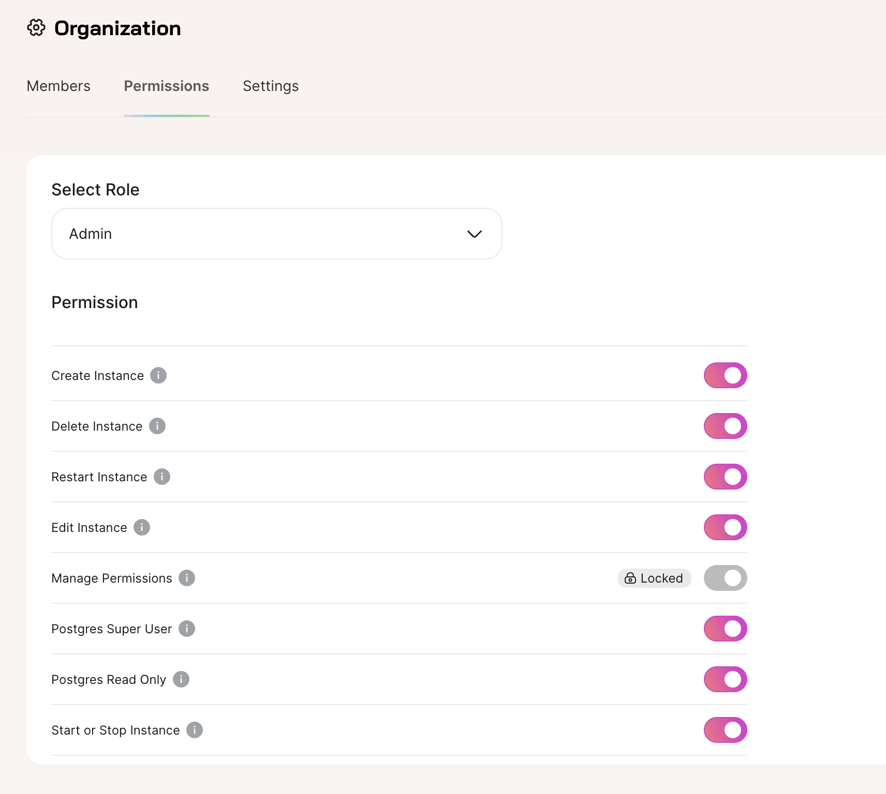

import Callout from '../../../../../components/Callout.astro';

Find in **Organization Settings > Permissions**

Find Organization settings by selecting your profile icon in the top right of the screen on Tembo Cloud.



Manage permissions by selecting which Role to modify permissions drop down. You can find the Role assigned to each person on your team in the Members tab.

# Tembo RBAC API

Tembo RBAC comprises **Roles**, **Actions**, and **Policies**.

Roles are assigned to Users to attach a permission sets to Users. Actions are the types of permissions supported by Tembo Cloud. Policies connect Actions to Roles.

Find the documentation in the [Tembo Cloud API](/docs/development/api).

## Roles

Currently, there are the **Admin** and **Member** roles available.

Example Role:
```json
{
  "id": "admin",
  "name": "Admin"
}
```

You can find the list of Roles on the Users tab of the Tembo Cloud UI, or by querying the [Tembo Cloud API](/docs/development/api).

## Actions

**Actions** are permissions that can be configured on Tembo Cloud.

Example Action:
```json
{
  "id": "PostgresReadOnly",
  "name": "Postgres Read Only",
  "description": "Access to the readonly user password."
}
```

You can find the list of Actions on the Permissions tab in the Tembo Cloud UI or by querying the [Tembo Cloud API](/docs/development/api).

## Policies

**Policies** connect **Actions** to **Roles**.

Example Policy:
```json
{
  "action": "PostgresReadOnly",
  "role": "admin",
  "allowed": true
}
```

You can find the list of active Policies by looking at the toggle state of Actions on the Permissions tab in the Tembo Cloud UI or by querying the [Tembo Cloud API](/docs/development/api).

<Callout variant='warn'>
The Admin role cannot have the Manage Permissions Action disallowed.
</Callout>
