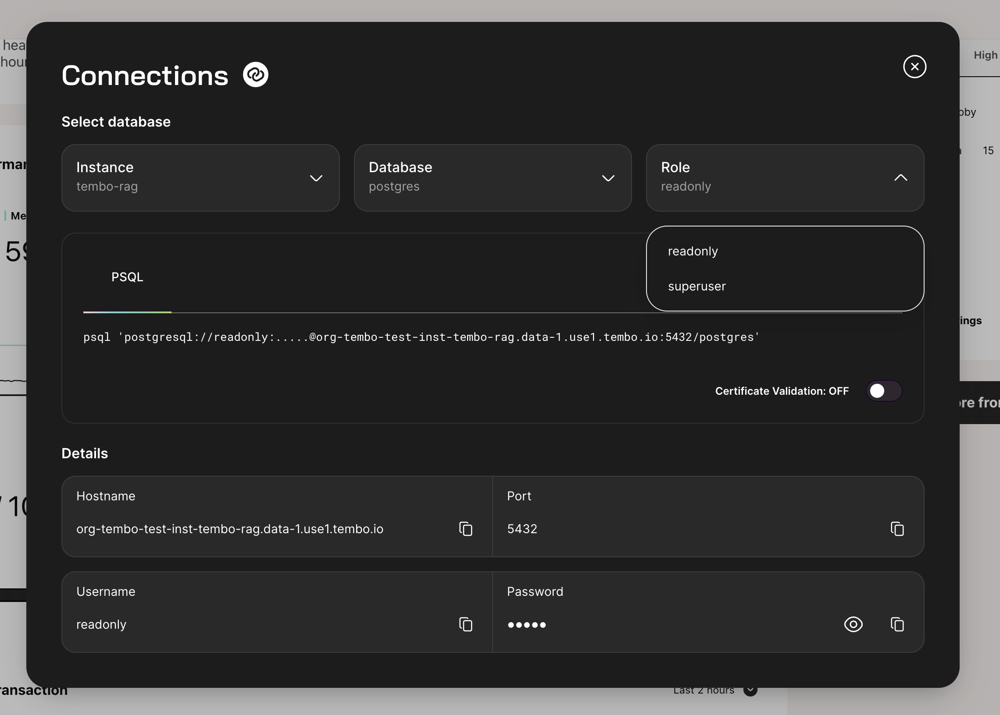

import Callout from '../../../../../components/Callout.astro';

Find in **Instance dashboard > Show connection strings**

## Permissions

The **readonly** user is granted the Postgres predefined-role [pg_read_all_data](https://www.postgresql.org/docs/current/predefined-roles.html).

## Connection

Connecting with **readonly** by default connects to the primary Postgres instance. To connect to a hot standby, please refer to the [connect to standby documentation](/docs/product/cloud/configuration-and-management/read-from-standby).
