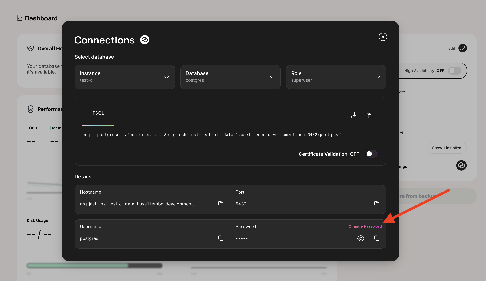

import Callout from '../../../../../components/Callout.astro';

This guide provides detailed instructions on how to update the PostgreSQL password for your instances managed through Tembo Cloud. Password updates can be performed directly through our interface or the API.

<Callout variant='warning'>
	Make sure your password is at least **16 characters long** and meets all specified security requirements.
</Callout>

## Through Tembo Cloud

Navigate to the **Connection String** section within the dashboard of the instance you want to update:

- **Access the Connection String**: Find and click on the **Connection String** section.
- **Initiate Password Update**: Click the **Update Password** button. Enter your new password in the provided input field.
- **Confirm the Change**: Click on the **Save Password** button. A confirmation notification will appear once the password has been successfully updated.



## Via API

For integration into your workflows, you can update the password using the API.

#### API Request Example

Replace the placeholders with your specific organization ID, instance ID, Secret Role, and Access Token to execute the password update:

```bash
curl -X 'PATCH' \
  'https://api.data-1.use1.tembo.io/api/v1/orgs/{Your Org ID here}/instances/{Your Instance ID here}/secrets/{Your Secret Role}' \
  -H 'accept: */*' \
  -H 'Authorization: Bearer {Your Access Token here}' \
  -H 'Content-Type: application/json' \
  -d '{
  "password": "{Your New Password here}"
}' 
```
<Callout variant='info'>
For a more interactive experience and to test various API functionalities, you can utilize our [Swagger UI](https://api.data-1.use1.tembo.io/swagger-ui/).
</Callout>