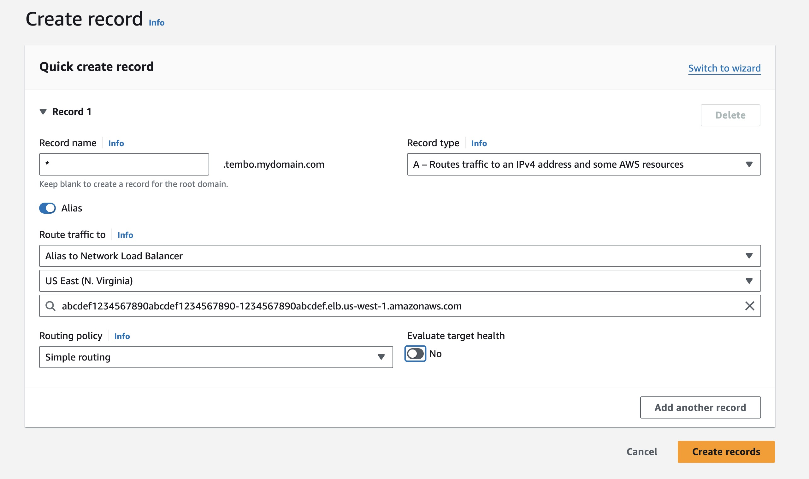

This guide describes the steps to install Tembo Self Hosted on AWS, which allows you to deploy a high-performance, fully-extensible managed Postgres service within an AWS Elastic Kubernetes Service (EKS) cluster.

## Step 1: Obtain prerequisites

Before starting this tutorial, you must install and configure the following tools and resources that you need to create and manage Tembo Self Hosted on an Amazon EKS cluster.

* The command-line tools for [AWS (awscli)](https://docs.aws.amazon.com/cli/latest/userguide/getting-started-install.html) and for [Kubernetes (kubectl)](https://kubernetes.io/docs/tasks/tools/).
* The command-line tool for [Amazon EKS (ekscli)](https://eksctl.io/installation/), used to create and manage your Tembo cluster on EKS.
* The [Helm CLI](https://helm.sh/docs/intro/install/).
* Obtain a [Clerk](https://clerk.com/) authentication key from Tembo.

## Step 2: Choose and setup a base domain

For the Tembo services, you will need to select a base domain, such as `tembo.mydomain.com`.

Once you have chosen your base domain, you must ensure you have the capacity to add and modify DNS records for it.

With this setup, your users will be able to access various subdomains to manage, monitor and run Postgres on the platform:

* Software UI: `app.tembo.mydomain.com`
* Backend requests: `api.tembo.mydomain.com`
* Tembo Dataplane: `dataplane.tembo.mydomain.com`

## Step 3: Create an EKS control plane and a Kubernetes cluster

To create an EKS cluster named `tembo-cluster` with a minimum of three nodes, run the following command:

```shell
eksctl create cluster --name tembo-cluster --nodes-min 3 --nodes-max 6 --node-type m5a.large --region us-east-1
```

Feel free to adjust the parameters as needed to suit your requirements.

TODO: recommend minimum size

For further information, see [Getting started with Amazon EKS](https://docs.aws.amazon.com/eks/latest/userguide/getting-started.html).

## Step 4: Creating the Amazon EBS CSI driver IAM role

To create an IAM role for the [Amazon EBS CSI driver](https://docs.aws.amazon.com/eks/latest/userguide/ebs-csi.html), run the following command:

```shell
eksctl create iamserviceaccount \
    --name ebs-csi-controller-sa \
    --namespace kube-system \
    --cluster tembo-cluster \
    --role-name AmazonEKS_EBS_CSI_DriverRole_tembo \
    --role-only \
    --attach-policy-arn arn:aws:iam::aws:policy/service-role/AmazonEBSCSIDriverPolicy \
    --region us-east-1 \
    --approve
```

We now need to find out the ARN for the role we just created.
Assuming the role name is `AmazonEKS_EBS_CSI_DriverRole_tembo`, we can run the following to identify the ARN:

```shell
$ aws iam list-roles | grep AmazonEKS_EBS_CSI_DriverRole_tembo
            "RoleName": "AmazonEKS_EBS_CSI_DriverRole_tembo",
            "Arn": "arn:aws:iam::123456789012:role/AmazonEKS_EBS_CSI_DriverRole_tembo"
```

This will be necessary for the next step.


## Step 5: Add the Amazon EBS CSI driver add-on

```shell
eksctl create addon \
     --name aws-ebs-csi-driver \
     --cluster tembo-cluster \
     --service-account-role-arn arn:aws:iam::123456789012:role/AmazonEKS_EBS_CSI_DriverRole_tembo \
     --region us-east-1 \
     --force
```

For `--service-account-role-arn`, supply the ARN created in Step 4.

## Step 6: Install Helm dependencies

1. Install [`cert-manager`](https://github.com/cert-manager/cert-manager)

```shell
helm install \
  cert-manager jetstack/cert-manager \
  --namespace cert-manager \
  --create-namespace \
  --version v1.14.4 --set installCRDs=true
```

2. Configure [Traefik](https://github.com/traefik/traefik)

Firstly, create the `traefik` namespace:

```shell
kubectl create namespace traefik || true
```

To configure which connections Traefik should accept, you can create a  [ConfigMap](https://kubernetes.io/docs/concepts/configuration/configmap/). If you want to accept all connections, use a ConfigMap similar to the one below:


```yaml
apiVersion: v1
kind: ConfigMap
metadata:
  name: postgres-catch-all
  namespace: traefik
data:
  postgres-catch-all.yaml: |
    tcp:
      routers:
        catchAll:
          entryPoints:
            - "postgresql"
          rule: "HostSNI(`*`)"
          service: empty
      services:
        empty:
          loadBalancer:
            servers: {}
```

Now, apply the ConfigMap you desire to use. If the accept-all configuration was chosen (as shown above), run:

```shell
kubectl apply -f traefik-postgres-catch-all.yaml
```

We now need to configure Traefik to handle Postgres connections appropriately. See the [example values](TODO) for reference.

Finally, install Traefik:

```shell
helm install traefik traefik/traefik --namespace traefik --version 20.8.0 -f traefik-values.yaml
```

### Step 7: Configure DNS for Traefik's Load Balancer

To properly route traffic to your Traefik load balancer, you need to configure a DNS CNAME record through your DNS provider. Follow the steps below to create a wildcard CNAME record, which is essential because each PostgreSQL instance has its own subdomain for its connection string.

1. **Access Your DNS Provider**: Log in to your DNS provider's management console.

2. **Create a Wildcard CNAME Record**: Set up a wildcard CNAME record (e.g., `*.tembo.mydomain.com`). This will cover all subdomains for your PostgreSQL instances.

3. **Use the External IP**: Point the wildcard CNAME record to the external IP of your Traefik load balancer. This external IP can be found using the command below.

```shell
kubectl get svc -n traefik
NAME      TYPE           CLUSTER-IP      EXTERNAL-IP                                                                      PORT(S)                                     AGE
traefik   LoadBalancer   10.200.50.100   abcdef1234567890abcdef1234567890-1234567890abcdef.elb.us-west-1.amazonaws.com   1234:56789/TCP,80:12345/TCP,443:23456/TCP   45m
```

If you're using Amazon Route 53, the configuration should look something like the image below. For more detailed information, refer to [Creating Records Using the Amazon Route 53 Console](https://docs.aws.amazon.com/Route53/latest/DeveloperGuide/resource-record-sets-creating.html).



4. **Verify DNS Settings**: After creating the CNAME record, verify that the DNS settings are correctly propagating and resolving.

You can use `nslookup` to check if your DNS settings are working correctly:

```shell
nslookup test.tembo.mydomain.com
;; Got recursion not available from 2001:4860:4860::8888, trying next server
;; Got recursion not available from 2001:4860:4860::8844, trying next server
Server:		8.8.8.8
Address:	8.8.8.8#53

Non-authoritative answer:
Name:	test.tembo.mydomain.com
Address: 203.0.113.10
Name:	test.tembo.mydomain.com
Address: 203.0.113.20
```


### Step 8: Update the StorageClass to allow for volume expansion

This is necessary for increasing storage size for Postgres instances.

```shell
kubectl patch storageclass gp2 -p '{"allowVolumeExpansion": true}'
```

## Step 9: Install the Tembo Self Hosted Helm chart

Clone the Tembo Self Hosted repository:

```shell
git clone https://github.com/tembo-io/tembo-self-hosted
```

Now, within the cloned `tembo-self-hosted` directory, create a file `my-values.yaml` with the following content:

```yaml
global:
  baseDomain: tembo.mydomain.com
  monitoringEnabled: true
  conductorEnabled: false
tembo:
  cpWebserver:
    env:
      - name: CLERK_SECRET_KEY
        value: <secret-key>
      - name: CLERK_WEBHOOK_SIGNING_SECRET
        value: <signing-secret>
      - name: STRIPE_SECRET_KEY
        value: <secret-key>
      - name: STRIPE_WEBHOOK_SIGNING_SECRET
        value: <signing-secret>
      - name: METRONOME_SECRET_KEY
        value: <secret-key>
```

The base domain should be the same one created in Step 2.

Now, let's install the Tembo Self Hosted Helm chart in your EKS cluster:

```shell
helm install tembo . -f my-values.yaml -n tembo --create-namespace
```

Let's now enable the `conductor` component:

```shell
global:
  baseDomain: tembo.mydomain.com
  monitoringEnabled: true
  conductorEnabled: true
```

Upgrade the Self Hosted Helm chart so that changes take effect:

```shell
helm upgrade tembo . -f my-values.yaml -n tembo
```

## Step 10: Check the status of the installation

```
❯ kubectl get po
NAME                                         READY   STATUS      RESTARTS      AGE
control-plane-1                              1/1     Running     0             82m
control-plane-queue-1                        1/1     Running     0             79m
tembo-cloudnative-pg-749dcfc655-756mm        1/1     Running     0             83m
tembo-conductor-fb7878d7-tvh94               1/1     Running     0             77m
tembo-conductor-watcher-7ff9547686-6sld8     1/1     Running     0             77m
tembo-controller-57899fffc4-d4j55            1/1     Running     0             82m
tembo-cp-reconciler-76bd8777b6-z2nq8         1/1     Running     0             81m
tembo-cp-service-75bccdddbd-b8xbk            1/1     Running     0             78m
tembo-cp-webserver-686fb69bb5-w5g6g          1/1     Running     0             78m
tembo-dataplane-webserver-7f9bd5cbf7-gkk2w   1/1     Running     0             83m
tembo-init-cp-db-lxl2t                       0/1     Completed   0             83m
tembo-init-cp-queue-db-lljgr                 0/1     Completed   0             83m
tembo-label-namespace-ggnml                  0/1     Completed   0             83m
tembo-pod-init-74975dbcb8-d9jpk              1/1     Running     0             83m
tembo-tembo-ui-685ccc9996-n8tmv              1/1     Running     0             83m
```

## Step 11: Access the Tembo Self Hosted

Access the Tembo Self Hosted UI by visiting http://app.tembo.mydomain.com in your browser. Replace tembo.mydomain.com with your domain name chosen in Step 2.

