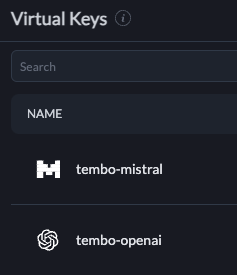

Vector search in Postgres requires embeddings, which are numerical representations of data that capture semantic meaning. There are many providers of embeddings, such as OpenAI, Mistral, and even the Tembo platform itself. This guide will walk you through setting up vector search capabilities in Tembo using [Portkey](https://portkey.ai)

Portkey's AI Gateway and Observability suite allows you to gain visibility and control over your AI apps. Portkey provides one of the best multimodal AI gateways, enabling seamless integration with 250+ LLMs. In this guide we will be using Portkey's Unified API to create embeddings with multiple providers seamlessly. 

Portkey also helps you control how your application scales with features such as caching, rate limiting, request retries, model fallback, and more.


## Getting Started

To generate embeddings for your data, you'll first need to [create a Tembo VectorDB](https://tembo.io/docs/product/cloud/configuration-and-management/create-instance) instance or any Postgres instance with [pg_vectorize](https://github.com/tembo-io/pg_vectorize?tab=readme-ov-file#installation) installed.

Once you are connected to Postgres, enable the extension.

```sql
CREATE EXTENSION IF NOT EXISTS vectorize CASCADE;
```

[Sign up](https://portkey.ai) for Portkey and create an account. Follow the Portkey documentation for setting up a [Virtual Key](https://docs.portkey.ai/docs/product/ai-gateway-streamline-llm-integrations/virtual-keys). Virtual Keys provide you with a convenient way to store and rotate your API keys

Update Postgres with your Portkey.ai API key

```sql
ALTER SYSTEM SET vectorize.portkey_api_key TO 'your-portkey-api-key';
SELECT pg_reload_conf();
```

Take note of the [Virtual Key](https://docs.portkey.ai/docs/product/ai-gateway-streamline-llm-integrations/virtual-keys) that you set up. In the examples below, we'll demonstrate using pg_vectorize with with Portkey for embeddings from both OpenAI and Mistral.

We've set up Virtual Keys for both [OpenAI](https://help.openai.com/en/articles/4936850-where-do-i-find-my-openai-api-key) and [Mistral](https://console.mistral.ai/api-keys/). Our Mistral and OpenAI API keys are stored securely in Portkey's secret vault.



Once your Portkey Virtual keys and Portkey API key are set up and stored in Postgres, you are ready to get going.

## Generating Embeddings with Portkey

Now we can generate embeddings from both OpenAI and Mistral, via Portkey, directly from SQL.

To generate embeddings from OpenAI, we set the `VIRTUAL_KEY` to the Postgres config `vectorize.portkey_virtual_key`, then make the request using `vectorize.encode`.
 The `VIRTUAL_KEY` is found on [Portkey's Virtual Key](https://app.portkey.ai/virtual-keys) dashboard in your Portkey account.

In the example below, we'll get embeddings from [Mistral's mistral-embed](https://docs.mistral.ai/capabilities/embeddings/) model.

```sql
set vectorize.portkey_virtual_key to 'tembo-mistral-<identifier>';
select vectorize.encode(
  input => 'Tell me the difference between a cat and a dog in 1 sentence',
  model => 'portkey/mistral/mistral-embed'
);
```

```text
{0.01513671875,0.03216552734375,0.052764892578125,0.047607421875 ....
```

And we can do the same by setting the `VIRTUAL_KEY` to the OpenAI Virtual Key we set up in Portkey.

```sql
set vectorize.portkey_virtual_key to 'tembo-openai-<identifier>';
select vectorize.encode(
  input => 'Tell me the difference between a cat and a dog in 1 sentence',
  model => 'portkey/openai/text-embedding-ada-002'
);
```

```text
{0.014064504,0.012763411,-0.0015216448,-0.010872065,0.0069053164,0.016108174 ...
```

## Embedding Maintenance with Portkey

Embeddings can be generated on-demand using `vectorize.encode`, but you can also ensure that your embeddings remain up-to-date as data in Postgres changes and grows.

We will use the sample products dataset (included with pg_vectorize) to demonstrate.

```sql
CREATE TABLE products (LIKE vectorize.example_products INCLUDING ALL);
INSERT INTO products SELECT * FROM vectorize.example_products;
```

To generate embeddings for all products in the table using the `product_name` and `description` columns as inputs to the model, we can use the following query.

```sql
set vectorize.portkey_virtual_key to 'tembo-openai-<identifier>';
SELECT vectorize.table(
    job_name    => 'product_search_portkey_mistral',
    "table"     => 'products',
    primary_key => 'product_id',
    columns     => ARRAY['product_name', 'description'],
    transformer => 'portkey/mistral/mistral-embed',
    schedule    => 'realtime'
);
```

Embeddings for every record in the table will be processed by the pg_vectorize background worker.
 We can check on the progress by inspecting the internal job queue. When all embeddings have been generated, the `queue_length` will be zero.

```sql
select * from pgmq.metrics('vectorize_jobs');
```

```sql
   queue_name   | queue_length | newest_msg_age_sec | oldest_msg_age_sec | total_messages |          scrape_time          
----------------+--------------+--------------------+--------------------+----------------+-------------------------------
 vectorize_jobs |            0 |                    |                    |             45 | 2024-08-26 12:58:08.579055-05
```

## Searching Embeddings with Portkey Embeddings

Now we can quickly search that entire table using `vectorize.search`.
 When we specify `job_name => 'product_search_portkey_mistral'`,
 pg_vectorize will handle calling Portkey/Mistral to generate embeddings for our `query`,
 then do vector similary search against all embeddings in our `products` table.

```sql
SELECT * FROM vectorize.search(
    job_name        => 'product_search_portkey_mistral',
    query           => 'accessories for mobile devices',
    return_columns  => ARRAY['product_id', 'product_name'],
    num_results     => 3
);
```

```text
                                         search_results                                         
------------------------------------------------------------------------------------------------
 {"product_id": 13, "product_name": "Phone Charger", "similarity_score": 0.772480098642506}
 {"product_id": 4, "product_name": "Bluetooth Speaker", "similarity_score": 0.7347913856330283}
 {"product_id": 23, "product_name": "Flash Drive", "similarity_score": 0.7077272695650859}
```

## Updating Embeddings

When new records are inserted (or existing records are updated) into our `products` table,
 new embeddings will be generated using all the parameters we specified in the `vectorize.table` function.
 This means the new record will have embeddings generated and inserted using Portkey/Mistral.

```sql
INSERT INTO products (product_id, product_name, description)
VALUES (12345, 'pizza', 'dish of Italian origin consisting of a flattened disk of bread');
```

Immediately will be generated asynchronously by the pg_vectorize background worker,
 the same as how they were generated during `vectorize.table`.
 Now when we search for "food items", we can see that embeddings have been updated for our new data.

```sql
SELECT * FROM vectorize.search(
    job_name        => 'product_search_portkey_mistral',
    query           => 'food items',
    return_columns  => ARRAY['product_id', 'product_name'],
    num_results     => 3
);
```

```text
                                      search_results                                       
-------------------------------------------------------------------------------------------
 {"product_id": 12345, "product_name": "pizza", "similarity_score": 0.6699686799834704}
 {"product_id": 5, "product_name": "Water Bottle", "similarity_score": 0.6590443743503676}
 {"product_id": 12, "product_name": "Travel Mug", "similarity_score": 0.6479905365789927}
```
