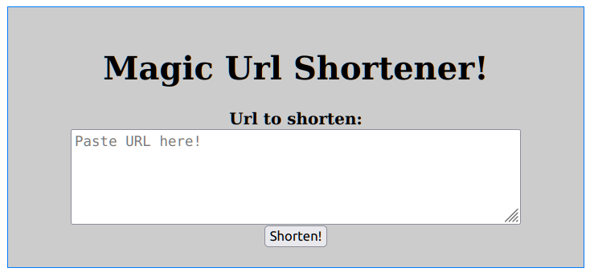

import Callout from '../../../../../components/Callout.astro';

We now have all of the tools necessary to build a very simplified application for shortening URLs. In this chapter, we'll build a short Svelte application that has the following characteristics:

1. The main page will display a form to enter an URL to shorten.
   a. On submission, the URL will be inserted into the Postgres `short_url` table.
   b. A result page will show the slug generated by Postgres during the insert.
2. Any path other than `/` will be redirected to the target URL based on the slug.
   a. If no URL exists, it will report an error and display the form instead.

The only times we'll need to interact with the database is when a new URL is submitted, and to retrieve encoded / shortened URL slugs. That equates to one insert--which is really just our function call--and a single select. This is about as simple as an application can be.

<Callout type='Info'>
	If you want to follow along with this project, clone the [Tembo-U github
	repository](https://github.com/tembo-io/tembo-u) and start in the
	`01-url-shortener` directory.
</Callout>

Let's get started!

## Bootstrapping the App

We've chosen [SvelteKit](https://kit.svelte.dev/) for this demonstration because of its terse and simplified syntax. The concepts discussed here should be applicable to any other stack as well, so please feel free to adapt them.

```bash
npm create svelte@latest app-demo
```

That `npm` command will present several prompts to customize the project folder itself. We want a skeleton project using TypeScript. There are optional elements for code linting, prettifying, or automated browser testing as well. Feel free to enable any that look interesting, but they aren't strictly necessary for this project.

Next we need to include all of the prerequisite libraries to get everything running:

```bash
cd app-demo

npm install
npm install pg
```

We should now have a bare-bones SvelteKit stack and a Postgres driver for connecting to and interacting with our database.

## The Database Library

If you've been following along with this course material, you should have this much so far:

1. A `short_url` table for storing and retrieving shortened URLs.
2. A `short_url_seq` sequence for supplying sequential numbers.
3. A `f_insert_url` function for base-62 encoding the number into a slug and inserting the URL.

We only really care about items one and three, since the `f_insert_url` function manages the sequence on our behalf. With that in mind, the amount of necessary interaction with the database is actually quite minimal. So minimal in fact, we can reduce it down to two functions!

For example, our insert function could work like this:

```ts
async function insertUrl(url: string): Promise<string> {
	const result = await conn.query('SELECT f_insert_url($1)', [url]);
	return result.rows[0].f_insert_url;
}
```

And the URL retrieval like this:

```ts
async function getUrl(slug: string): Promise<string | null> {
	const result = await conn.query(
		'SELECT url FROM short_url WHERE slug = $1',
		[slug],
	);
	return result.rowCount > 0 ? result.rows[0].url : null;
}
```

Assuming we set up the `conn` connection earlier in the library, that's the full extent of our Postgres database API. It's also the reason we started with this project: it's incredibly simplified compared to what we'll consider in later examples.

We've taken the liberty of creating a more formal definition in the `src/lib/db.ts` file of our project. Take a look!

## The Landing Page

Remember, all we need to display is a simple form field encouraging users to supply an URL for us to shorten. For a SvelteKit project, that means we need to modify the `+page.svelte` file in the `src/routes` directory to contain something like this:

```jsx
<h1>Magic Url Shortener!</h1>
<form method="POST" action="/new">
  <label for="url">Url to shorten:<br/>
  <textarea name="url" rows="5" cols="50"
   placeholder="Paste URL here!"
   required></textarea>
  </label><br/>
  <button>Shorten!</button>
</form>
```

With a bit of CSS wizardry, it should look something like this:



It's not _especially_ pretty or functional, but this is an admittedly simplified application. Note that this form submits to the `/new` route, meaning we've set aside a path for receiving new URL submissions. Let's move on to making it work.

<Callout variant='Info'>
	We _could_ have designed the form to submit to the same page and used clever
	form manipulation to toggle between an empty form and a "Success" message by
	outputting the shortened URL. However, we elected to keep it simple and also
	reduce render overhead. The front page is entirely static with this design.
	We will make frequent use of such techniques in future modules.
</Callout>

## Inserting New URLs

The `src/routes/new` folder denotes a new "route" to the `/new` path of our URL shortener. This needs to come in two parts: inserting the URL, and displaying the new slug. In a SvelteKit project, that means we need two files to handle each of those events.

Let's start with `new/+page.server.ts` which will insert the URL.

```ts
import { error } from '@sveltejs/kit';
import DB from '$lib/db.ts';

export const actions = {
	default: async ({ request }) => {
		const data = await request.formData();
		const url = data.get('url');

		try {
			const db = new DB();
			const slug = await db.insertUrl(url);
			return { slug, url };
		} catch (e) {
			throw error(500, e.message);
		}
	},
};
```

What's happening here? SvelteKit [form actions](https://kit.svelte.dev/docs/form-actions) tell us to define a "default" function the kit calls when receiving a `POST` request. That function can obtain the submitted form data by invoking `request.formData`, and we only really care about the `url` field. The code we care about merely passes the `url` to the `insertUrl` database method we defined earlier.

That function _also_ returns the slug associated with the URL. Any structured object we return will be available as data to the display page. So we've chosen to return _both_ the slug and URL so we can customize the output. Perhaps we want to say, "You changed URL \{ url \} to \{ slug \}, congrats!" or something.

And those form handling results are displayed in the `new/+page.svelte` file:

```jsx
<script>
export let form;
</script>

<h1>Shortened URL:</h1>
<h2>http://localhost/{form.slug}</h2>
<p>Congrats, your URL has been shortened to something much cleaner!</p>
<p><a href="/">Shorten another URL!</a></p>
```

In this case, we've decided to only display the slug. Feel free to modify the file to incorporate the URL in the results as well!

## Intentional Misdirection

The last--and one might argue _primary_--job of our URL Shortener is to redirect visitors to _any other location_ than `/` or `/new` to wherever the short-code dictates. SvelteKit allows routes to consist entirely of parameters if named in square braces. So we place our last required file in the `src/routes/[slug]` directory.

Since we're working purely with the server side in this case, we only need a `+page.server.ts` file:

```ts
import { error, redirect } from '@sveltejs/kit';
import DB from '$lib/db.ts';

export async function load({ params }) {
	let url = '';

	try {
		const db = new DB();
		url = await db.getUrl(params.slug);
	} catch (e) {
		throw error(500, e.message);
	}

	if (url) {
		return redirect(308, url);
	}

	throw error(
		404,
		'Someone provided you with a bad link, or perhaps it was mistyped.',
	);
}
```

The code here is even simpler than what we used to insert a new URL since no forms are involved. All we need to do is call the `getUrl` function we defined in the database library and pass the slug. If we retrieved a valid URL, redirect the user to that location, and if not, tell the user they provided a bad slug.

<Callout variant='Info'>
	You may have noticed that we didn't call the `redirect` function in the try
	/ catch block. Svelte treats this function as an exception, so it would
	immediately trigger our catch condition and rather than redirect to the
	target URL, it would cause an Internal Server Error!
</Callout>

Note that we don't actually need a `+page.svelte` file for front-end display in this case. There is nothing to display!

## Exploring the Project

Believe it or not, the files below comprise _all_ of the required elements for the SvelteKit project:

```
src/
|-- lib
|   |-- db.ts
`-- routes
    |-- new
    |   |-- +page.server.ts
    |   `-- +page.svelte
    |-- +page.svelte
    `-- [slug]
        `-- +page.server.ts
```

The demo version of the project includes some extra layout and error handling to enhance the overall look and feel of the interface. The `+page.svelte` files in the various route folders carry the heavy-lifting when it comes to display. And the `+page.server.ts` files handle all of the server-side concerns, such as inserting or retrieving URLs from Postgres.

If you haven't already, hopefully this is enough encouragement to download the code for this course and explore it a bit. There isn't much to it, and you'll learn a bit about how Postgres can act as a data-store for an URL shortening application.

If you're only interested in the database portion, pay special attention to the `src/lib/db.ts` file. One thing we didn't mention when explicitly describing the `insertUrl` and `getUrl` functions is how we defined the database connection:

```ts
constructor() {
  this.pool = new Pool({
    user: PGUSER,
    host: PGHOST,
    port: PGPORT,
    database: PGDATABASE,
    password: PGPASSWORD
  });
}
```

The `pg` driver provides a [database pool](https://node-postgres.com/apis/pool) mechanism for "sharing" connections. We chose this approach to avoid unnecessarily overloading Postgres with connection requests. Most URL shorteners handle an extremely high request throughput, but the queries themselves are extremely simple.

This project uses the pool for a single query at a time, with no need for long transactions. Thus, several app threads should be able to efficiently share a small handful of client-side sessions.

<Callout variant='Info'>
	Always think about the pressure on the database for each series of database
	calls, even at the connection level. The more you can reduce this, the
	faster and less brittle everything else will be.
</Callout>
