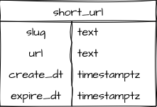

import Callout from '../../../../../components/Callout.astro';

The anatomy of an URL shortener is refreshingly simple. Let's consider what we actually need:

* The full URL itself.
* The portion of the shortened link that comes after the slash, often referred to as a slug. This should be short and unique across all links.

Technically we could build the entire app with only these two pieces of data. However, there's often some bookkeeping that's good to keep for internal purposes. It's probably a good idea to know when the link was shortened, and potentially when it should expire.

## Deriving the Model

If we take the extra details into account, our initial data model looks something like this:



And the equivalent table definition is equally mundane:

```sql
CREATE TABLE short_url (
  slug       TEXT NOT NULL PRIMARY KEY,
  url        TEXT NOT NULL UNIQUE,
  create_dt  TIMESTAMPTZ NOT NULL DEFAULT now(),
  expire_dt  TIMESTAMPTZ NULL
);
```

Let's look at these in a bit more detail.

## Exploring the Columns

With only one table consisting of five fields, this is about as simple as a table design can be. Why did we make these decisions and what do they mean?

### The `slug` Field

This is the shortened version of the URL, the text that comes after the slash in our final generated link.

This field also acts as a "natural" primary key in this simplified design. We know it must be unique because our URL shortener should only redirect any shortened link to the full URL it represents.

We will discuss the methodology for generating this value a bit later.

<Callout variant='Info'>
Natural keys are values that occur organically within data, such as an email address, username, or an article slug. They're often used as primary keys because they 
directly reflect the underlying data in a way some abstract numeric value doesn't.

More intricate models tend to rely heavily on _surrogate_ keys, which are an abstract value assigned to each row arbitrarily. This is often a monotonically increasing sequence, and tends to be built into the database engine itself. We don't need these here because of our model's inherent simplicity, but we'll definitely introduce them in subsequent modules.
</Callout>

### The `url` Field

This field represents the full text of the URL we're shortening. We want this to be unique so we don't repeatedly shorten the same url.

Notice how both the `slug` and `url` fields use `TEXT` in this table? Postgres has [several text types](https://www.postgresql.org/docs/current/datatype-character.html) such as `VARCHAR` as well, but `TEXT` is the more modern approach due to its flexibility.

<Callout variant='Info'>
`VARCHAR` is commonly used to enforce a content length to certain fields. Older data models may declare `VARCHAR(255)` for instance, preventing storage of values with lengths greater than 255 characters. This can cause problems if future data require a larger field because we must modify the table definition. Doing so may be extremely difficult if there are any dependent objects such as views.

Most experts recommend a `CONSTRAINT` to enforce field length to avoid this.

For example, if we want to prevent URLs greater than 2000 characters:

```sql
ALTER TABLE short_url 
  ADD CONSTRAINT enforce_url_len
CHECK (length(url) < 2000);
```
</Callout>

### The `create_dt` Field

We've also decided to store the date the row is created and inserted into the table. This happens because we've specified `DEFAULT now()`, which provides the current timestamp for the transaction which inserted the row.

We use `TIMESTAMPTZ` here to mean "time stamp with time zone". Of the [various date and time types](https://www.postgresql.org/docs/current/datatype-datetime.html), it's usually recommended because the recorded value is always standardized to GMT. As such, times are always absolute rather than dependent on the time zone of the data source, or influenced by daylight saving time.

### The `expire_dt` Field

This field lets us specify when the shortened link should expire, if at all.

This is really the only "optional" data in this table. We may design our application to never allow links to last more than a year, certain links may never expire, and so on. We use `TIMESTAMPTZ` here as well for the same reasons we used for `create_dt`.

Now that we have our basic table defined, let's build the actual simplified application.

## Handling Ownership

Some other important elements include object ownership and access. For safety sake, we don't want to rely on the `postgres` superuser for anything if we don't need to. It's permissible for table ownership for example, but we _definitely_ don't require that level of access to merely interact with the data. If the primary [CRUD](https://learnsql.com/blog/what-is-crud/) user doesn't own the table, it's much more difficult for malicious attacks to drop tables or other objects.

With that in mind, here's the recommended way to provide secure access to our `short_url` table:

```sql
CREATE ROLE short_rw;
CREATE USER short_user WITH PASSWORD 'remember-me';
GRANT short_rw TO short_user;

CREATE SCHEMA shorten;
GRANT USAGE ON SCHEMA shorten TO short_rw;
ALTER USER short_user SET search_path = 'shorten';

/* Create the short_url table here. */

GRANT SELECT, INSERT, UPDATE, DELETE ON TABLE shorten.short_url TO short_rw;
```

We did _several_ important things here:

1. Created a role specific for reading and writing to tables.
2. Created a _separate_ user for interacting with the data.
3. Granted the permissive role to the user. Why the separation? It allows us to create a read-only role later for monitoring or reporting purposes. It also decouples the use cases, so we can grant the read-write role to other users on a permanent or temporary bases.
4. Created a schema for tables in our app to live in. This isn't required, but is good practice because it imposes a namespace so we can cleanly leverage the same database for multiple contexts.
5. Gave the permissive role access to the new schema.
6. Modified the login user so the _only thing they see_ is the schema for the URL shortener. There's less confusion this way and less room for error.
7. Granted read and write operations to the permissive role. Since the login user has access to this role, they also have access to the table.

This is a good pattern to follow on most projects, and one most experts will use as a starting point. There are more advanced use cases we'll explore in later lessons as well.
